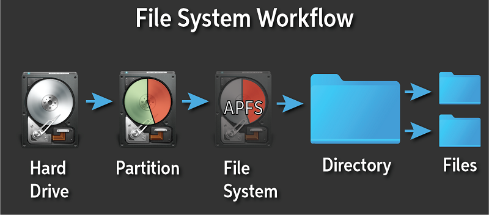

# HỆ THỐNG TỆP TIN

## Data Storage Device

Là *thiết bị lưu trữ dữ liệu*. Là một khái niệm tổng quát về bất kỳ phương pháp hay thiết bị dùng để lưu trữ thông tin kỹ thuật số.

Các loại *thiết bị lưu trữ dữ liệu* có thể kể đến bao gồm: Disk, Cloud Storage, Flash memory,...

- **Disk**: hay còn gọi là *ổ đĩa*, là một phương tiện vật lý để lưu trữ dữ liệu.

## Type of Storage Devices

HHD (Hard Disk Drive) và SSD (Solid State Drive) là hai loại *thiết bị lưu trữ dữ liệu* được sử dụng trong hệ thống máy tính.

- HDD: sử dụng đĩa từ quay và đầu đọc/ghi để lưu trữ và truy cập dữ liệu.
- SSD: sử dụng bộ nhớ flash để lưu trữ dữ liệu, tương tự các USB hoạt động.

## Partition

Hay còn gọi là *phân vùng*. Là việc chia nhiều một thiết bị lưu trữ vật lý thành nhiều phân vùng tách biệt. Mỗi *phân vùng* có thể được sử dụng để lưu các loại dữ liệu hoặc *hệ điều hành* khác nhau.

## Partition Schemes

Hay còn gọi là *chuẩn phân vùng ổ cứng* là những phương pháp cho tổ chức và quản lý các *phân vùng* trên *thiết bị lưu trữ dữ liệu*. Chúng xác định cách thông tin phân vùng được lưu trữ trên đĩa và cách phân vùng được cấu trúc như thế nào.

Có hai loại *chuẩn phân vùng ổ cứng* phổ biến là MBR (Master Boot Record) và GPT (GUID Partition Table).

## File System

Hay *hệ thống tệp tin* là một phương pháp và cấu trúc dữ liệu mà một *hệ điều hành* (Operating System) sử dụng để kiểm soát việc làm thế nào mà dữ liệu được lưu trữ và trích xuất trên *thiết bị lưu trữ dữ liệu*.

## File System Types

*Loại hệ thống tệp tin* đề cập đến các cấu trúc và phương pháp được sử dụng bởi *hệ điều hành* để lưu trữ, tổ chức, và quản lý các tệp tin và thư mục trên một *phân vùng* hoặc *thiết bị lưu trữ dữ liệu*.

Nó xác định dữ liệu được lưu trữ và trích xuất, và bao gồm 
các quy tắc cho tên tệp tin, cấu trúc thư mục, quyền, ... như thế nào.

Một số *loại hệ thống tệp tin* bao gồm FAT32, NTFS, EXT4, XFS, ...

Xem thêm *hệ thống tệp tin trên Linux* tại [Linux File System](../linux-file-system/index.md).

## DIRECTORY

Hay còn gọi là *thư mục*. Dùng để chứa các *thư mục* hay *tệp tin* bên trong nó.

## FILE

Hay còn gọi là *tệp tin*. Là dơn vị cơ bản để chứa dữ liệu. *Tệp tin* có thể là hình ảnh, văn bản, âm thanh, ... hay tệp thực thi.

## Block

Là dơn vị nhỏ nhất được *hệ thống tệp tin* sử dụng để đọc/ghi dữ liệu. Các tập tin được chia thành các *block* và được lưu trữ trên ổ đĩa.

## Mounting

Là một quá trình làm cho *hệ thống tệp tin* sẵn sàng để sử dụng. Một *hệ thống tệp tin* phải được *mount* để có thể truy cập đến các tệp được lưu trên *thiết bị lưu trữ dữ liệu*.

## Unmounting

Là một quá trình tháo một *hệ thông tệp tin* khỏi *hệ điều hành*, đảm bảo rằng mọi dữ liệu đã được ghi trên *thiết bị lưu trữ dữ liệu* và hệ thống có thể được gỡ bỏ một cách an toàn.

## Fragmentation

Hay *phân mảnh*, chúng xảy ra khi dữ liệu không được lưu trữ trong các khối liên tiếp (tuần tự) trên *ổ đĩa*. Đây là hệ quả từ việc tạo, xóa và điều chỉnh kích thước tệp thường xuyên. Theo thời gian, tệp tin trở nên lớn hơn hoặc nhỏ lại, hệ thống cần chia các tệp thành các chunk nhỏ hơn, phân chia chúng tại nhiều vị trí khác nhau trên *ổ đĩa*.
