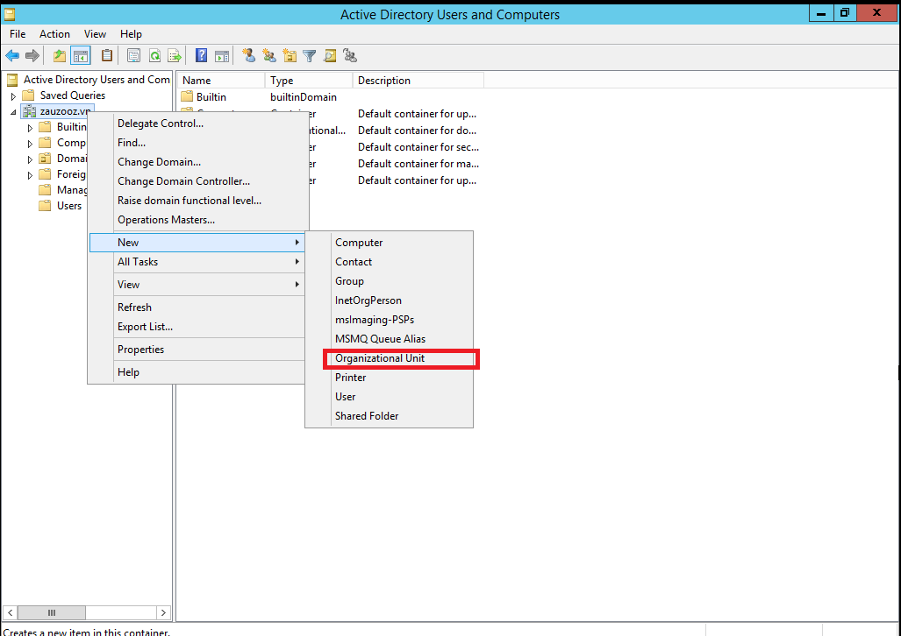
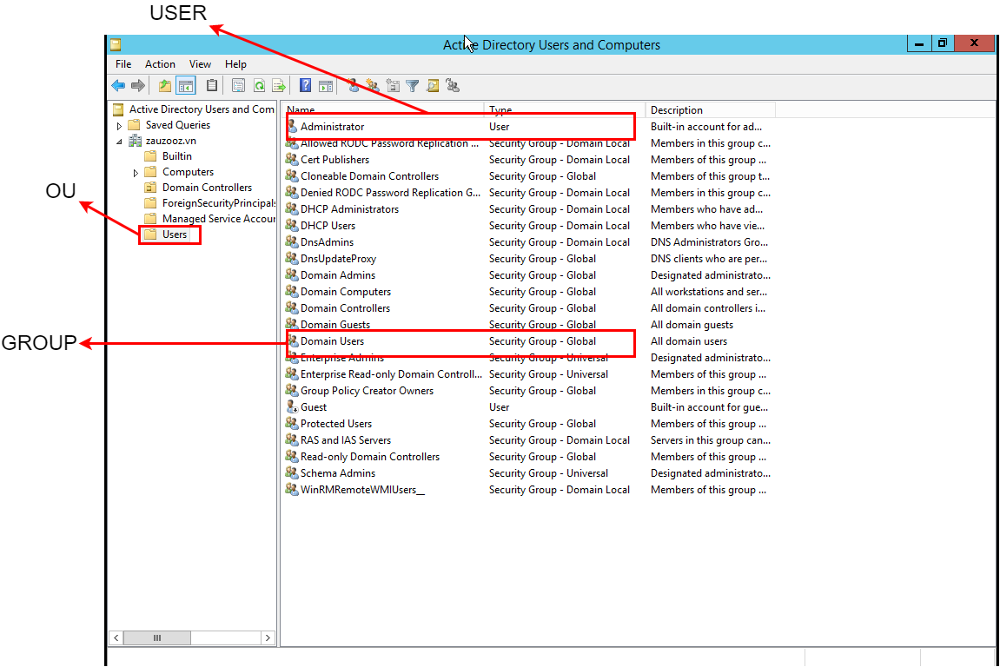

# CÁC KHÁI NIỆM QUAN TRỌNG TRONG WINDOWS SERVER

## Directory

### What is Directory?

Directory (thư mục) là một cấu trúc phân cấp mà nó chứa thông tin về các Objects trong một mạng.

### Directory Service

Hay gọi là dịch vụ thu mục, cung cấp những phương pháp cho việc lưu trữ dữ liệu thư mục và làm cho dữ liệu này sẵn sàng cung cấp cho người dùng hoặc người quản trị. Một số dịch vụ thư mục có thể kể đến bao gồm: Microsoft Active Directory, Novel eDirectory, Red Hat Directory Server, Azure Active Directory, ...

### Directory Server

Là một máy chủ mà nó chạy và cung cấp phần mềm dịch vụ thư mục cho người dùng hay người quản trị.

## Object

Mỗi một tài nguyên trên mạng, như dung lượng, thư mục, tệp, máy in, người dùng (user), nhóm (group), các thiết bị, số điện thoại và nhiều thứ khác, được đề cập là một Object bởi Directory Server.

### User

...

### Group

...

### Policy

#### What is Policy

...

#### Security Policy

...

#### Group Object Policy

...

## Window Domain

Là một dạng mạng máy tính mà trong đó tất cả các tài khoản người dùng (user accounts), máy tính, máy in và nguyên tắc bảo mật khác (security principles), cùng tham gia vào một cơ sở dữ liệu tập trung trên một hoặc nhiều cụm máy chủ chẳng hạn như [Domain Controller (DC)](./index.md#active-directory-service-hay-ad-role). Hay còn gọi là mạng máy tính được quản lý bằng miền.

- Việc xác thực được diễn ra trên DC. Mỗi người sử dụng máy tính nằm trong miền sẽ được nhận một tài khoản duy nhất mà nó được gán quyền truy cập đến các tài nguyên trong domain.

## Active Directory

Hoặc Microsoft Active Directory: là một dịch vụ thư mục được phát triển bởi Microsoft cho mạng Window domain.

### Active Directory Service hay AD Role

Liên quan đến một bộ các dịch vụ và công nghệ là một phần hay liên quan đến dịch vụ thư mục Active Directory, bao gồm:

- **Active Directory Domain Services (AD DS)**: Là một server role trong Active Directory, nó xác thực (Authentication) và ủy quyền (Authorization) cho các [User](./index.md#user) và computer trong mạng [Window domain](./index.md#window-domain), chỉ định và thực thi các chính sách bảo mật (Security Policy) cho toàn bộ máy tính, cũng như cài đặt hay cập nhật phần mềm.
  - **Domain Controller (DC)**: Là một Active Directory server chạy role Active Directory Domain Service (AD DS).

Ngoài ra còn có một số dịch vụ khác như **Active Directory Lightweight Directory Service (AD LDS)**, **Active Directory Certificate Service (AD CS)**, **Active Directory Federation Service (AD FS)**, **Active Directory Rights Management Service (AD RMS)**, ...

## Directory Service Protocol

Hay giao thức dịch vụ thư mục, là các quy tắc và định dạng dữ liệu cho phép giao tiếp và truy cập thông tin trong một dịch vụ thư mục.

### Lightweight Directory Access Protocol (LDAP)

Là một giao thức dịch vụ thư mục giúp giao tiếp (thực hiện các cơ chế như kết nối, tìm kiếm, chỉnh sửa, ...) với các directory (như Active Directory).

- **Quản lý thông tin người dùng**: LDAP là một giao thức để truy cập và duy trì thông tin trong dịch vụ thư mục. Nó tập trung vào việc lưu trữ dữ liệu như thông tin người dùng, nhóm, vai trò và quyền hạn trong một cấu trúc dạng cây phân cấp.
- **Truy vấn và tra cứu**: LDAP cho phép truy vấn thông tin về người dùng và tài nguyên từ một thư mục trung tâm. Nó thường được dùng để xác thực, nhưng không phải là giao thức xác thực an toàn.

## Authentication

### New Technology LAN Management (NTLM)

Là một giao thức xác thực dựa trên challenge-response. NTLM không cung cấp mức độ bảo mật cao như [Kerberos](./index.md#kerberos) và dễ bị tấn công replay attack hoặc pass-the-hash attack.

### Kerberos

Là một giao thức xác thực mạng dựa theo ticket được thiết kế để cung cấp xác thực an toàn trong môi trường mạng không tin cậy, chẳng hạn như mạng nội bộ và mạng Internet, để chứng minh danh tính của họ với nhau một cách an toàn.

## Forest, Tree và Domain

### Domain

Một Active Directory domain hay một domain là một cơ sở dữ liệu lưu trữ các [Objects](./index.md#object) như user, computer và group mà chúng chia sẻ chung một cơ sở dữ liệu xác thực.

### Root domain

Hay root là domain đầu tiên nơi cấu trúc cây Active Directory (Active Directory Tree hay đơn giản là Tree) bắt đầu.

Ví dụ, ta có root domain là `zauzooz.vn` và có hai domain con (subdomain) cùng cấp với nhau là `hr.zauzooz.vn` và `dev.zauzooz.vn`.

### Organizational Unit (OU)

Là một Container Object trong Active Directory mà nó cho phép tổ chức và quản lý tài nguyên như user, computer, và các Object khác của bạn. OU như một thư mục ảo mà bạn có thể sử dụng để nhóm các tài nguyên có điểm chung (chẳng hạn như vị trí, phòng ban hoặc mục đích chung) và quản lý chúng một cách tập thể.

### Tree hay Active Directory Tree

Trong Active Directory, Active Directory Tree hay Tree là *một tập hợp có phân cấp cha-con các domain biểu diễn theo cấu trúc cây*. Những domain trong một cây sẽ chia sẻ chung một quy ước đặc tên chung.

- Ví dụ, ta có root domain là `zauzooz.vn` và có hai domain con cùng cấp với nhau là `hr.zauzooz.vn` và `dev.zauzooz.vn`. Ba domain này cùng nhau tạo thành một cấu trúc Active Directory Tree `zauzooz.vn` với root domain `zauzooz.vn` và hai subdomain là `hr.zauzooz.vn` và `dev.zauzooz.vn`.

### Forest

Hay Active Directory Forest là tổ chức cao nhất trong Active Directory dùng để nhóm một hay nhiều Active Directory Tree lại với nhau. Forest cho phép người quản trị chỉ định các Security Policy chung, trong khi các Tree và Domain cho phép quản trị với các Security Policy chi tiết hơn. Mỗi Active Directory sẽ có ít nhất một Forest.

### Trust Relationship hay Trust

Là mối quan hệ giữa hai thực thể (một Domain hoặc một Forest với một Domain hoặc Forest khác) để có thể chia sẻ tài nguyên với nhau. AD DS cung cấp bảo mật trên nhiều Tree hay Forest thông qua Trust Relationship. Trước khi việc xác thực có thể xảy ra trên Trust, Windows sẽ kiểm tra domain đang được yêu cầu bởi người dùng, máy tính hoặc dịch vụ có Trust Relationship với domain của tài khoản thực hiện yêu cầu đó hay không.

- **Trust Directions**: Trust Relationship cho phép truy cập tài nguyên có thể theo hướng một chiều (One-way Trust) hoặc hai chiều (Two-way Trust):
  - **One-way Trust**: Nếu như Domain A và Domain B hình thành một One-way Trust, thì các user thuộc Domain A sẽ truy cập được tài nguyên trong Domain B, nhưng ngược lại thì không.
  - **Two-way Trust**: Nếu như Domain A và Domain B hình thành một Two-way Trust, thì các user thuộc Domain A sẽ truy cập được tài nguyên trong Domain B, ngược lại thì user từ Domain B cũng truy cập được vào tài nguyên trong Domain A.
- **Trust Transitivity**: Sự chuyển tiếp (Trust Transitivity) có thể được mở rộng ra ngoài giữa 2 domain mà nó được hình thành hay không.
  - **Transitive Trust**: Trust Relationship có thể mở rộng với domain khác. Cụ thể, nếu Domain A trust Domain B, và Domain B trust Domain C, thì Domain A sẽ trust Domain C.
  - **Non-transitive Trust**: Trust bị giới hạn lại giữa hai domain đang trong Trust Relationship.
- **Các loại Trust Relationship**:
  - **Parent-Child Trust**: Là một Transitive Trust và Two-way Trust, Parent-Child Trust được hình thành một cách tự động khi một child domain được tạo ra trừ một parent domain.
  - **Tree-root Trust**: Là một Transitive Trust và Two-way Trust. Khi tạo một Domain Tree được tạo ra, nó sẽ tạo một Tree-root Trust một cách tự động giữa nó với tất cả các Domain Tree khác đang tồn tại.
  - **Forest Trust**: Là một Transitive Trust và One-way Trust hoặc Two-way Trust. Forest Trust được thành lập một cách thủ công giữa hai Forest.
  - **Shortcut Trust**: Là một Transitive Trust và One-way Trust. Những Trust được tạo ra một cách thủ công.
  - **External Trust**: Là một Non-transitive Trust và One-way Trust. Những Trust này được thành lập một cách thủ công.
  - **Realm Trust**: Là một Trust Relationship được hình thành giữa một Domain hay Forest này với một Domain hoặc Forest khác. Realm Trust mặc định là One-way Trust, và nó cũng là Non-transitive Trust. Ta có thể tạo hai One-way Trust để hình thành một mối quan hệ Trust hai chiều.
