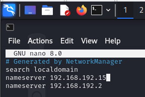
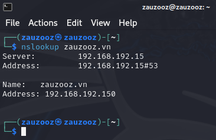
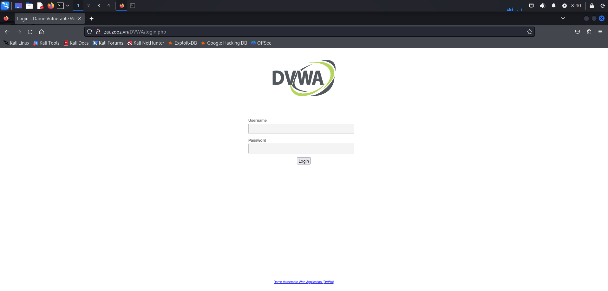

# BIND9 DNS CHO TRÊN UBUNTU SERVER 20.04 CHO MẠNG NỘI BỘ

## BÀI TOÁN

## CẤU HÌNH ĐỊA CHỈ IP TĨNH

Sử dụng công cụ `netplan` để cấu hình địa chỉ IP tĩnh cho DNS Server:

```
sudo nano /etc/netplan/00-installer-config.yaml
```

Cần đảm bảo rằng tên interface (của tôi quá trình thử nghiệm là `ens33`) khớp với hệ thống của bạn. Có thể kiểm tra bằng lệnh `ip a` để xác định interface chính xác.

Thay đổi nội dung tệp `00-installer-config.yaml` như bên dưới:

```
network:
  ethernets:
    ens33:
      dhcp4: false
      addresses: [192.168.192.15/24]
      gateway4: 192.168.192.2
      nameservers:
        addresses: [192.168.192.2, 8.8.8.8]
  version: 2
```

Dùng `sudo netplan apply` để thay đổi địa chỉ IP.

## CÀI ĐẶT BIND9

Cập nhật hệ thống bằng lệnh `sudo apt-get update -y`. Tiếp theo cài đặt BIND9 bằng lệnh `sudo apt-get install bind9`.

## CẤU HÌNH DNS

Tạo backup cho bản gốc nhằm đảm bảo có thể khôi phục lại cấu hình ban đầu nếu có lỗi xảy ra.

```
mkdir bind-backup
cp bind/*  bind-backup/
```

Dùng `sudo nano /etc/hosts`, thực hiện bổ sung dòng `192.168.192.15 zauzooz.vn` vào tệp `host`:

```
127.0.0.1 localhost
127.0.1.1 dns
192.168.192.15 zauzooz.vn

# The following lines are desirable for IPv6 capable hosts
....
```

Tiếp theo dùng lệnh `sudo nano /etc/bind/named.conf.options` để bổ sung một số nội dung trong tệp cấu hình `named.conf.options`.

```
options {
        ....
        recursion yes;                 # cấu hình cần bổ sung
        listen-on {192.168.192.15;};   # cấu hình cần bổ sung
        forwarders {8.8.8.8;8.8.4.4;}; # cấu hình cần bổ sung
};
```

### TẠO FORWARD LOOKUP ZONE VÀ REVERSE LOOKUP ZONE

Tiếp theo dùng lệnh `sudo nano named.conf.local` để bổ sung nội dung trong tệp cấu hình `named.conf.local`:

```
// forward lookup zone
zone "zauzooz.vn" IN {
    type master;
    file "/etc/bind/db.zauzooz.vn";
};

// reverse lookup zone
zone "192.168.192.in-addr.arpa" IN {
    type master;
    file "/etc/bind/db.192.168.192";
};
```

### CẤU HÌNH CÁC RECORD

Đầu tiên thực hiện `sudo cp /etc/bind/db.local /etc/bind/db.zauzooz.vn` để sao chép nội dung `db.local` vào một tệp mới `db.zauzooz.vn` để thuận tiện cho việc cấu hình, thay vì phải ngồi gõ từng con chữ.

Dùng lệnh `sudo nano /etc/bind/db.zauzooz.vn` để điều chỉnh cấu hình forward lookup.

Xóa các dòng

```
@       IN      NS      localhost.
@       IN      A       127.0.0.1
@       IN      AAAA    ::1
```

```

;
; BIND data file for local loopback interface
;
$TTL    604800
@       IN      SOA     ns.zauzooz.vn. root.ns.zauzooz.vn. (
                              2         ; Serial
                         604800         ; Refresh
                          86400         ; Retry
                        2419200         ; Expire
                         604800 )       ; Negative Cache TTL
;
@       IN      NS      ns.zauzooz.vn.
ns      IN      A       192.168.192.15
@       IN      A       192.168.192.150
```

Tương tự như trên, dùng lệnh `sudo cp /etc/bind/db.127 /etc/bind/db.192.168.192`

Sử dụng lệnh `sudo nano /etc/bind/db.192.168.192` để bắt đầu cấu hình reverse lookup.


Xóa dòng:

```
1.0.0   IN      PTR     localhost
```

```
;
; BIND reverse data file for local loopback interface
;
$TTL    604800
@       IN      SOA     ns.zauzooz.vn. root.ns.zauzooz.vn. (
                              1         ; Serial
                         604800         ; Refresh
                          86400         ; Retry
                        2419200         ; Expire
                         604800 )       ; Negative Cache TTL
;
@       IN      NS      ns.zauzooz.vn.
15      IN      PTR     ns.zauzooz.vn.
150     IN      PTR     zauzooz.vn.
```

### KHỞI ĐỘNG LẠI DỊCH VỤ

Sau khi hoàn tất cấu hình, cần khởi động lại dịch vụ `bind9` để chúng hoạt động với những cấu hình mới bằng lệnh `sudo service bind9 restart`.

## THỰC HIỆN KIỂM TRA

Tại máy Kali Linux, thực hiện lệnh `sudo nano /etc/resolv.conf` và bổ sung `nameserver 192.168.192.15` (Khi khởi động máy lại, tệp `resolv.conf` này sẽ trở lại tình trạng ban đầu, tức không có dòng `nameserver 192.168.192.15`).



Thử sử dụng lệnh `nslookup zauzooz.vn` để kiểm tra, ta thấy kết quả phân giải đúng như ta cấu hình.



Sử dụng browser Firefox của Kali Linux và truy cập domain `zauzooz.vn` thử, kết quả đăng nhập thành công.



## MỘT SỐ LỆNH CẦN THIẾT

|Lệnh|Ý nghĩa|
|:---|---:|
|`sudo service bind9 start`   |Chạy dịch vụ `bind9`               |
|`sudo service bind9 stop`    |Dừng dịch vụ `bind9`               |
|`sudo service bind9 restart` |Khởi động lại dịch vụ `bind9`      |
|`sudo service bind9 status`  |Kiểm tra trạng thái dịch vụ `bind9`|
