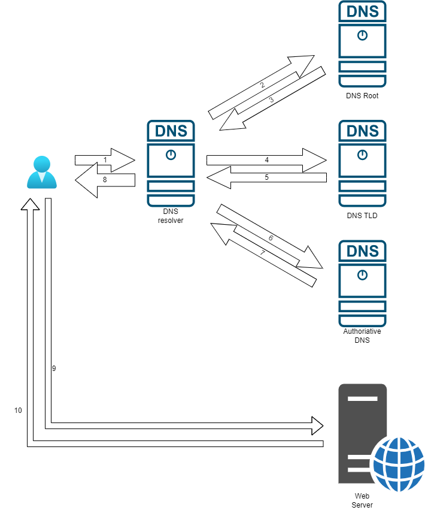

# DOMAIN NAME SYSTEM

DNS như là một cuốn danh bạ điện thoại của Internet, đảm nhận việc chuyển đối các tên miền mà con người có thể nhớ sang dạng địa chỉ IP để có thể truy cập Internet, đặc biệt là Web [[1]](https://www.cloudflare.com/learning/dns/what-is-dns/).

## QUÁ TRÌNH THỰC HIỆN

Dựa vào [[1]](https://www.cloudflare.com/learning/dns/what-is-dns/) và [[3]](https://www.cloudflare.com/learning/dns/dns-records/), ta có thể tổng quát cách hoạt động của DNS server như sau:

- (1\): User gửi một DNS request đến DNS resolver. Đối với các máy được cấp phát địa chỉ IP động, sẽ có danh sách các DNS server kèm theo.

- (2\) và (3): Trong trường hợp DNS resolver cache có thông tin để phản hồi cho yêu cầu DNS thì đến bước (8). Nếu không sẽ thực hiện các bước (4) đến (7). DNS resolver sẽ gửi request đến DNS root name server để nhận phản hồi. Các phản hồi có thể được chứa trong root zone hoặc đưa ra các gợi ý về các Top-Domain-Level (TLD) server mà chứa câu trả lời cho yêu cầu [[5]](https://www.cloudflare.com/learning/dns/glossary/dns-root-server/).

- (4\) và (5): TLD name server chứa các top-level-domain như là com, org, edu, uk,... [[4]](https://www.cloudflare.com/learning/dns/dns-server-types/) [[5]](https://www.cloudflare.com/learning/dns/top-level-domain/). DNS resolver khi nhận được phản hồi từ DNS root server về TLD domain server cần hỏi thì DNS resolver thực hiện gửi request đến DNS TLD Server. DNS TLD Server sẽ trả lời về các Authoriative Server mà đang giữ thông tin về tên miền đó [[4]](https://www.cloudflare.com/learning/dns/dns-server-types/).

- (6\) và (7): DNS resolver gửi yêu cầu đến Authoriative Server chứa các câu trả lời chính xác cho DNS request, thông tin về Authoriative Server được nhận từ phản hồi của DNS TLD Server trước đó. Câu trả lời DNS này sẽ được lưu lại trong cache đủa DNS Resolver để có thể tái sử dụng trong tương lai [[4]](https://www.cloudflare.com/learning/dns/dns-server-types/), [[7]](https://www.cloudns.net/blog/authoritative-dns-server/).

- (8\): User nhận phản hồi DNS.

- (9\) và (10): khi đã có thông tìn về phân giải tên miền sau các bước trên, có thể sử dụng web browser để thực hiện truy cập web.

## CÁC BẢN GHI CẦN NHỚ

Một số DNS record phổ biến như [[2]](https://www.cloudflare.com/learning/dns/dns-records/):

- **A record**: bản ghi liên quan đến việc dịch một tên miền thành một địa chỉ IP.
- **CNAME record**: chuyển tiếp một tên miền hoặc tên miền phụ sang tên miền khác, không phải địa chỉ IP.
- **NS record**: chứa các name server cho một bản DNS.
- **MX record**: chuyển hướng đến máy chủ email.

## REFERENCE

[1] <https://www.cloudflare.com/learning/dns/what-is-dns/>

[2] <https://aws.amazon.com/route53/what-is-dns/>

[3] <https://www.cloudflare.com/learning/dns/dns-records/>

[4] <https://www.cloudflare.com/learning/dns/dns-server-types/>

[5] <https://www.cloudflare.com/learning/dns/glossary/dns-root-server/>

[6] <https://www.cloudflare.com/learning/dns/top-level-domain/>

[7] <https://www.cloudns.net/blog/authoritative-dns-server/>
