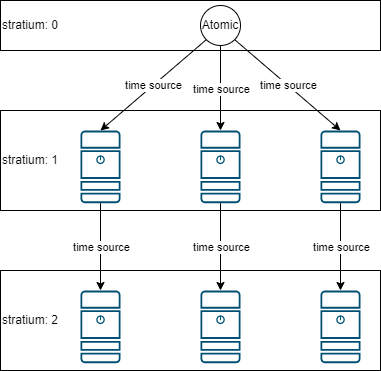

# NETWORK TIME PROTOCOL

NTP là giao thức dùng để đồng bộ thời gian của các thiết bị mạng.

Là giao thức thuộc tầng Application.

NTP là một giao thức sử dụng hệ thống thứ bậc (hierarchical) để quản lý tài nguyên thời gian.

Các tài nguyên đó được gọi là Stratum, giá trị stratum càn nhỏ thì chất lượng của nguồn thời gian là càng lớn. Các nguồn thời gian có chất lượng tốt nhất là đồng hồ nguyên tử (Atomic clock), đồng hồ GPS (GPS clock) hay đồng hồ Radio (Radio clock).

## REFERENCE

[1] <https://www.rfc-editor.org/rfc/rfc958>

[2] <https://datatracker.ietf.org/doc/html/rfc5905>

[3] <https://www.geeksforgeeks.org/network-time-protocol-ntp/>
