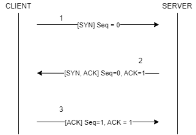

# TRANSMISSION CONTROL PROTOCOL

## TCP Header

- Source port: 16 bit, cổng giao tiếp ở máy nguồn.

- Destination port: 16 bit, cổng giao tiếp ở máy đích.

- Sequence number: 32 bit, phục vụ cho vận chuyển gói tin đáng tin cậy.

- Acknowledgement Number: 32 bit, phục vụ cho vận chuyển gói tin đáng tin cậy.

- Header Length: 4 bit, độ dài của TCP header (thông thường là 20 bytes khi không có thông tin nào ở trường Options)

- Flags chiếm 8 bit, một số cờ quan trọng:
    - URG: Ám chỉ dữ liệu là "khẩn cấp", dữ liệu này sẽ được ưu tiên xử lý trước các dữ liệu khác trong buffer.
    - ACK: Ám chỉ trường Acknowledgement đang được sử dụng.
    - PSH: Ám chỉ máy nhận cần đẩy dữ liệu lên tầng cao hơn ngay lập tức.
    - RST: Dùng trong hủy kết nối đột ngột, hủy ngay lập tức không bắt tay gì hết.
    - SYN: Dùng trong thiết lập kết nối.
    - FIN: Dùng trong hủy kết nối, bắt tay 3 bước để hủy kết nối.

- Receiver window: 16 bit, sử dụng trong kiểm soát luồng (Flow Control).

- Internet checksum: Giá trị dùng để đảm bảo tính toàn vẹn của dữ liệu trong suốt quá trình vận chuyển gói tin.

- Ugent data pointer: đề cập đến vị trí byte mà trong phân đoạn nơi mà dữ liệu khẩn cấp kết thúc. Khi sử dụng trường này thì cờ URG cũng sẽ được bật.

- Options: Các tùy chọn bổ sung cho header.

- Data: Dữ liệu ở tầng cao hơn (tầng ứng dụng).

## QUY TRÌNH BẮT TAY 3 BƯỚC (THREE-WAY HANDSHAKE)

(1) CLIENT gửi gói tin [SYN], thực hiện khởi tạo kết nối mới, cờ SYN được sử dụng.

(2) SERVER nhận được gói [SYN] và gửi về gói [SYN, ACK] thông báo rằng SERVER đồng ý khởi tạo kết nối.

(3) CLIENT nhận được gói [SYN, ACK] và biết được SERVER đồng ý khởi tạo kết nối, CLIENT gửi gói [ACK] cho server và kết nối lúc này đã được khởi tạo, hai máy bây giờ có thể trao đổi dữ liệu.

## TCP ACK, WINDOW SIZE AND SLIDING WINDOW

...

## REFERENCE

[1] <https://datatracker.ietf.org/doc/html/rfc9293>
