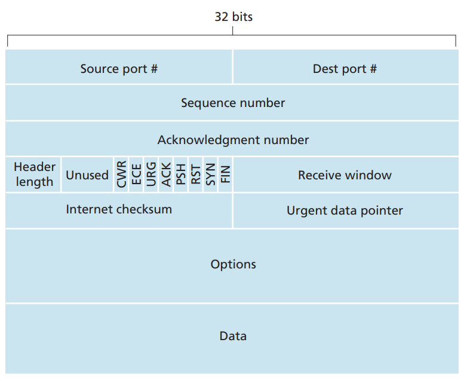

# TRANSMISSION CONTROL PROTOCOL

## TCP Header

Source port: 16 bit, cổng giao tiếp ở máy nguồn.

Destination port: 16 bit, cổng giao tiếp ở máy đích.

Sequence number: 32 bit, phục vụ cho vận chuyển gói tin đáng tin cậy.

Acknowledgement Number: 32 bit, phục vụ cho vận chuyển gói tin đáng tin cậy.

Header Length: 4 bit, độ dài của TCP header (thông thường là 20 bytes khi không có thông tin nào ở trường Options)

Flags chiếm 6 bit:

- CWR: 
- CEC: 
- URG: 
- ACK: 
- PSH: Ám chỉ máy nhận cần đẩy dữ liệu lên tầng cao hơn ngay lập tức.
- RST: Dùng trong hủy kết nối đột ngột, hủy ngay lập tức không bắt tay gì hết.
- SYN: Dùng trong thiết lập kết nối.
- FIN: Dùng trong hủy kết nối, bắt tay 3 bước để hủy kết nối.

Window Size: 16 bit, sử dụng trong kiểm soát luồng (Flow Control).

TCP checksum: Đảm bảo tính toàn vẹn của dữ liệu trong suốt quá trình vận chuyển gói tin.

Ugent pointer:

Options:

Data: Dữ liệu ở tầng cao hơn (tầng ứng dụng).

## QUY TRÌNH BẮT TAY 3 BƯỚC (THREE-WAY HANDSHAKE)

## TCP ACK, WINDOW SIZE AND SLIDING WINDOW
