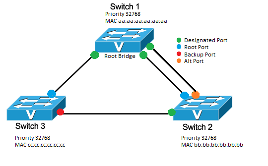

# SPANNING TREE PROTOCOL IN DETAIL

## SPANNING TREE PROTOCOL OVERVIEW

Giao thức STP chạy trên các bridge và switch của tuân thủ theo chuẩn 802.1D, giúp năng chặn loop xảy ra trong mạng cũng như là tạo ra một liên kết dự phòng [[3]](https://www.cisco.com/c/en/us/support/docs/lan-switching/spanning-tree-protocol/5234-5.html).

## VERSION OF SPANNING TREE

Một số giao thức STP [[5]](https://www.ciscopress.com/articles/article.asp?p=2832407&seqNum=5):

- Spanning Tree Protocol (STP) - được định nghĩa trong IEEE 802.1D.
- Per-VLAN Spanning Tree (PVST+) - cung cấp một 802.1D spanning-tree instance riêng biệt cho mỗi VLAN được cấu hình trong mạng.
- Rapid Spanning Tree Protocol (RSTP) - định nghĩa trong IEEE 802.1w, một bản nâng cấp của STP cung cấp tốc độ hội tụ nhanh hơn STP.
- Rapid Per-VLAN Spanning Tree (Rapid PVST+) - là nâng cao của RSTP mà sử dụng PVST+ và cung cấp một 802.1w instance riêng cho mỗi VLAN.
- Multiple Spanning Tree Protocol (MSTP) - định nghĩa trong IEEE 802.1s, ánh xạ nhiều VLAN vào cùng một spanning-tree instance.

Bảng so sánh [[5]](https://www.ciscopress.com/articles/article.asp?p=2832407&seqNum=5):

|Protocol|Standard|Resources Needed|Covergence|STP Tree Calculation|
|:-------|:-------|:---------------|:---------|:-------------------|
|STP|IEEE 802.1D|Low|Slow|all VLANs|
|PVST+|Cisco|High|Slow|Per VLAN|
|RSTP|IEEE 802.1w|Medium|Fast|All VLANs|
|Rapid PSTV+|Cisco|High|Fast|Per VLANs|
|MSTP|IEEE 802.1s|Medium or High|Fast|Per STP instances|

## BRIDGE PROTOCOL DATA UNIT (BPDU)

Khi một thiết bị switch hay bridge được bật lên thì nó sẽ được hoạt động như là STP root [[1]](https://www.cisco.com/c/en/us/td/docs/routers/access/3200/software/wireless/SpanningTree.html#wp1040274).

BPDU chứa các thông tin về bridge gửi và cổng của nó, bao gồm địa chỉ bridge và địa chỉ MAC, **bridge priority**, **port priority** và **past cost**. STP sẽ sử dụng những thông tin này để bầu chọn ra [[[1]](https://www.cisco.com/c/en/us/td/docs/routers/access/3200/software/wireless/SpanningTree.html#wp1040301)]:

- **spanning-tree root** và **root port** cho mạng
- **root port** và **designated port** cho phân đoạn mạng LAN.

## ELECTION MECHANISM - CONVERGENCE

Các thiết bị lớp 2 tham gia vào STP thu thập thông tin về các thiết bị bridge/switch khác trong mạng bằng cách trao đổi các thông điệp BPDU. Việc trao đổi thông điệp này nhằm thực hiện mục đích:

- Chọn ra spanning-tree root cho mỗi spanning-tree instance.
- Chọn ra designated bridge cho mỗi phân đoạn mạng VLAN.
- Loại bỏ các loop trong mạng bằng cách cho cổng kể nối với liên kết dự phòng/dư thừa vào trạng thái Blocking.

Quy trình bầu chọn STP diễn ra như sau [[2]](https://documentation.meraki.com/MS/Port_and_VLAN_Configuration/Spanning_Tree_Protocol_(STP)_Overview):

- Một switch port nhận các BPDU vượt trội (dựa vào Bridge ID) từ các switch khác và xác định đây là root switch. Switch có priority (Bridge ID) cao nhất (có giá trị priority nhỏ nhất) sẽ được đề cử làm root bridge. Nếu các bridge đều được cấu hình priority mặc định là 32768, thì bridge có địa chỉ MAC nhỏ nhất sẽ được đề cử làm root bridge [[1]](https://www.cisco.com/c/en/us/td/docs/routers/access/3200/software/wireless/SpanningTree.html#wp1040301).
- Port có path cost nhỏ nhất ở các switch khác root bridge sẽ được bầu chọn là root port.
- Nếu path cost giống nhau, root port được chọn sẽ dựa theo Bridge ID nhỏ nhất.
- Nếu Bridge ID lại giống nhau (thông thường có cùng một switch), sẽ chọn port có giá trị vật lý thấp nhất là root port.

## BRIDGE ID, PORT PRIORITY, PATH COST

**Bridge ID** bao gồm bridge priority và địa chỉ MAC cho mỗi một thiết bị bridge hay switch [[1]](https://www.cisco.com/c/en/us/td/docs/routers/access/3200/software/wireless/SpanningTree.html#wp1040258).

Khi 2 port là một phần của loop, port priority và past cost sẽ xác định interface nào sẽ ở trạng thái Forwarding và interface nào sẽ ở trạng thái Blocking. **Port priority** biễu diễn vị trí của interface trong kiến trúc mạng và vị trí của nó tốt như thế nào để đẩy luồng mạng đi. **Path cost** biễu diễn tốc độ truyền thông của interface đó [[1]](https://www.cisco.com/c/en/us/td/docs/routers/access/3200/software/wireless/SpanningTree.html).

## PORTFAST

...

## ROOT PORT, DESIGNATE PORT AND ALTERNATE PORT

Một số vai trò của port [[2]](https://documentation.meraki.com/MS/Port_and_VLAN_Configuration/Spanning_Tree_Protocol_(STP)_Overview)

- **Root port**: port trên non-root bridge có giá trị path cost ít nhất. Path cost ít nhất tương đương với con đường tốt nhất đến root-bridge.
- **Designated port**: port trên các  root và designated switch. Các port trên root-bridge sẽ là designated port.
- **Block port**: các port còn lại đến switch sẽ ở trạng thái Blocking. Access port đến các máy trạm hay PC thì không ảnh hưởng.

Trong RSTP, block port được chia làm 2 [[2]](https://documentation.meraki.com/MS/Port_and_VLAN_Configuration/Spanning_Tree_Protocol_(STP)_Overview):

- **Alternate port**: nhận BPDU từ các switch khác nhưng vẫn duy trì trạng thái Blocking. Vi dụ như một switch có 2 đường đến root bridge, thì sẽ bầu một port là root port, còn một port là alternated port.
- **Backup port**: nhận BPDU từ chính nó nhưng vẫn duy trì trạng thái Blocking. Ví dụ switch kết nối với đến 2 switch khác nhau thì một port sẽ được bầu là root, port còn lại sẽ là block.

Hình xem tại [[2]](https://documentation.meraki.com/MS/Port_and_VLAN_Configuration/Spanning_Tree_Protocol_(STP)_Overview).

## PORT STATE

Các trạng thái của Spanning-Tree Interface (port), các trạng thái được liệt kê theo thứ tự [[1]](https://www.cisco.com/c/en/us/td/docs/routers/access/3200/software/wireless/SpanningTree.html), [[2]](https://documentation.meraki.com/MS/Port_and_VLAN_Configuration/Spanning_Tree_Protocol_(STP)_Overview):

- **Blocking** - khi một thiết bị kết nối vào, port sẽ ở trạng thái block. Ở trạng thái block interface *không tham gia vào chuyển tiếp frame*.
- **Listeining** - Trạng thái chuyển tiếp sau trạng thái **blocking**, trong đó spanning tree xác định rằng interface này sẵn sàng tham gia vào chuyển tiếp frame.
- **Learning** - Interface chuẩn bị để tham gia chuyển tiếp frame.
- **Forwarding** - Interface sẽ chuyển tiếp gói tin.
- **Disabled** - Interface không tham gia vào spanning tree vì port đang tắt nguồn, không có liên kết trên port đó hoặc không có spanning tree nào đang chạy trên port.

## REFERENCE

[1] <https://www.cisco.com/c/en/us/td/docs/routers/access/3200/software/wireless/SpanningTree.html>

[2] <https://documentation.meraki.com/MS/Port_and_VLAN_Configuration/Spanning_Tree_Protocol_(STP)_Overview>

[3] <https://www.cisco.com/c/en/us/support/docs/lan-switching/spanning-tree-protocol/5234-5.html>

[4] <https://www.ciscopress.com/articles/article.asp?p=2832407&seqNum=5>
