# Điều gì sẽ xảy ra nếu xóa 1 vlan trên VTP server switch

Cho mô hình mạng bên dưới

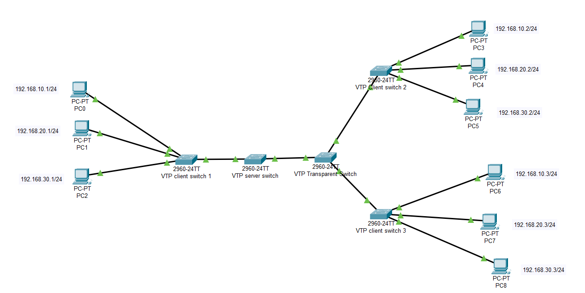

Cấu hình các địa chỉ cho các máy có địa chỉ X.Y.10.Z (PC0, PC 3 và PC 6) sẽ thuộc VLAN 10, X.Y.20.Z (PC 1, PC 4 và PC 7) thuộc VLAN 20 và X.Y.30.Z (PC 2, PC 5 và PC 8) thuộc VLAN 30.

Cấu hình VTP có domain name là IT.

## Giả sử xóa VLAN 30 để thí nghiệm

Trong trường hợp VLAN 30 chưa xóa, PC 2 ping thành công đến PC 5 và PC 8.

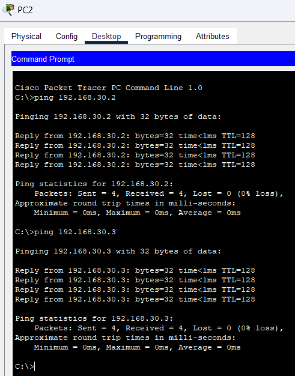

Sau khi xóa VLAN 30, PC 2 không còn ping đến PC 5 và PC 8 nữa.

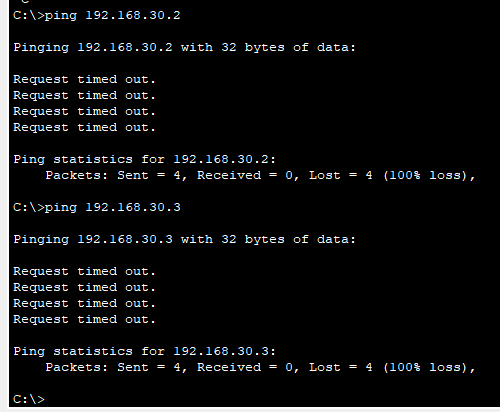

Kiểm tra VLAN trên VTP client switch 1, như đã thấy VLAN 30 đã biến mất.

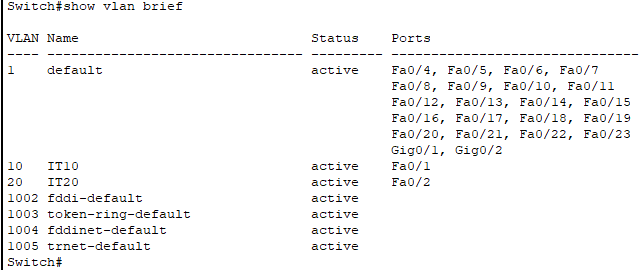

Kiểm tra VLAN trên VTP client switch 2, như đã thấy VLAN 30 đã biến mất.

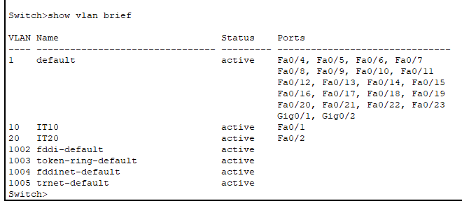

Kiểm tra VLAN trên VTP client switch 3, như đã thấy VLAN 30 đã biến mất.

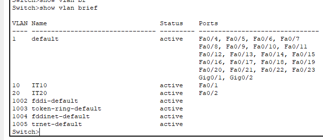

## Khôi phục lại VLAN 30 sau khi đã xóa

Thử thực hiện khôi phục lại VLAN 30, sau đó thực hiện ping PC 2 đến PC 5 và PC 8. Như đã thấy dường như VLAN 30 ở các VTP switch client đã được khôi phục như trước khi được xóa.

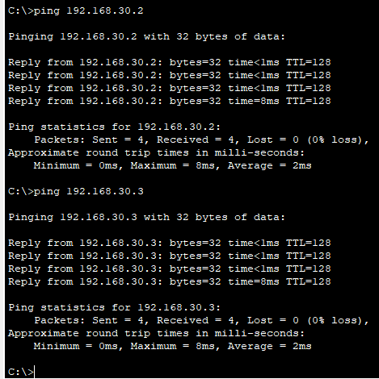

Kiểm tra các VLAN có trên VTP client switch 1, như đã thấy đầy đủ 3 VLAN 10, 20 và 30.

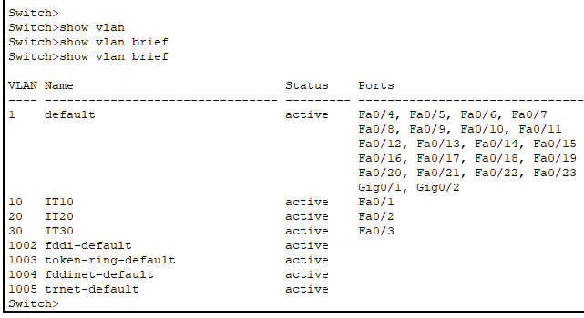

Kiểm tra các VLAN có trên VTP client switch 2, như đã thấy đầy đủ 3 VLAN 10, 20 và 30.

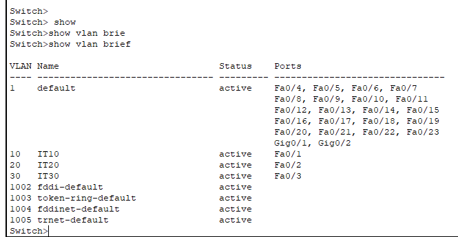

Kiểm tra các VLAN có trên VTP client switch 3, như đã thấy đầy đủ 3 VLAN 10, 20 và 30.

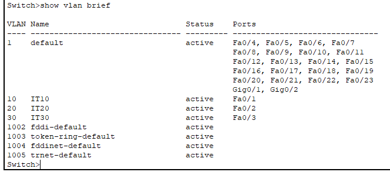

## Tạo VLAN 40 thay vì VLAN 30 sau khi đã xóa

Kiểm tra các VLAN có trên VTP client switch 1, như đã thấy có các VLAN 10, 20 và 40 nhưng không có VLAN 30, VLAN 40 không được gán cho bất kỳ port nào.

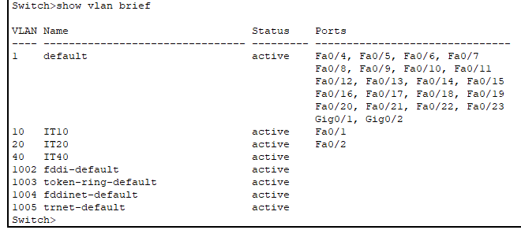

Điều này cũng xảy ra tương tự như trên VTP client switch 2 và 3.

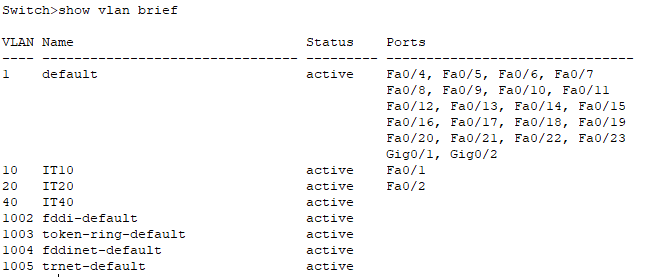

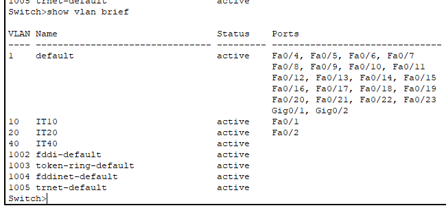
