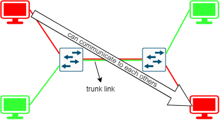

# Switching

## VLAN

...

## Access, Trunk

Các cổng trunk (trunk ports) là các cổng mà có thể mang các luồng mạng thuộc các VLAN khác nhau, giúp các máy cùng VLAN nhưng khác switch có thể giao tiếp với nhau, có hai chuẩn đóng gói Trunk là IEEE 802.1Q và Inter-Switch Link Protocol (ISL) [[5]](https://www.cisco.com/c/en/us/support/docs/lan-switching/8021q/24067-195.html).

## 802.1Q

...

## Dynamic Trunking Protocol (DTP)

DTP là giao thức dùng để tạo một liên kết trunk giữa 2 switch và cũng như đóng gói hay đánh dấu bằng 802.1Q hoặc ISL [[5]](https://www.cisco.com/c/en/us/support/docs/lan-switching/8021q/24067-195.html). Giao thức hoạt động ở tầng 2 trong mô hình OSI. DTP là giao thức của các máy Cisco [[1]](https://www.geeksforgeeks.org/dynamic-trunking-protocol-dtp/).

|                 |Dynamic Auto|Dynamic Desirable|Trunk               |Access      |
|:---------------:|:----------:|:---------------:|:------------------:|:----------:|
|Dynamic Auto     |access      |trunk            |trunk               |access      |
|Dynamic Desirable|trunk       |trunk            |trunk               |access      |
|Trunk            |trunk       |trunk            |trunk               |limited connectivity|
|Access           |access      |access           |limited connectivity|access      |

## VLAN Trunking Protocol (VTP)

VLAN Trunking Protocol (VTP) giảm bớt việc quản trị trong mạng chuyển mạch (switch network). Khi bạn định cấu hình Vlan mới trên một máy chủ VTP (VTP server), Vlan sẽ được phân phối qua tất cả các thiết bị chuyển mạch trong miền. Điều này làm giảm nhu cầu cấu hình cùng một VLAN ở mọi nơi. VTP là giao thức độc quyền của Cisco có sẵn trên hầu hết các sản phẩm thuộc dòng Cisco Catalyst. Không bao gồm phiên bản 3 của VTP [[2]](https://www.cisco.com/c/en/us/support/docs/lan-switching/vtp/10558-21.html).

Cấu hình VTP cisco tại [[3]](https://www.cisco.com/c/en/us/support/docs/lan-switching/vtp/98154-conf-vlan.html), bao gồm có 3 chế độ [[1]](https://www.cisco.com/c/en/us/support/docs/lan-switching/vtp/10558-21.html):

- **Server**: Trong chế độ VTP server, bạn có thể tạo, sửa đổi và xóa Vlan cũng như chỉ định các tham số cấu hình khác, chẳng hạn như VTP version và  VTP pruning, cho toàn bộ miền VTP. Các máy chủ VTP quảng cáo cấu hình Vlan của chúng tới các thiết bị chuyển mạch khác trong VTP domain và đồng bộ hóa cấu hình Vlan của chúng với các thiết bị chuyển mạch khác dựa trên các quảng cáo nhận được qua các liên kết trunk. Máy chủ VTP là chế độ mặc định. [*Điều gì sẽ xảy ra nếu xóa 1 vlan trên VTP server switch*](../experiment/VTP_test/index.md).
- **Client**: VTP client hoạt động giống như VTP server, nhưng bạn không thể tạo, thay đổi hoặc xóa Vlan trên VTP client.
- **Transparent**: VTP Transparent Switch không tham gia vào VTP. VTP Transparent Switch không quảng cáo cấu hình Vlan của nó và không đồng bộ hóa cấu hình Vlan dựa trên các quảng cáo nhận được, nhưng các transparent switch sẽ chuyển tiếp các quảng cáo VTP mà chúng nhận được từ các trunk port của chúng trong VTP version 2.

## Spanning Tree Protocol (STP)

...

## MultiProtocol Label Switching (MPLS)

MPLS là một kỹ thuật để tăng tốc kết nối mạng [[8]](https://www.cloudflare.com/learning/network-layer/what-is-mpls/). MPLS thực hiện định tuyến một con đường ngắn nhất dựa trên "nhãn" hơn là [dựa trên địa chỉ IP như thông thường](../4_4_Routing/index.md). Các tổ chức sử dụng công nghệ này khi họ có nhiều chi nhánh khác trong nước hay ngoài nước để truy cập vào cơ sở dữ liệu hay ứng dụng của trụ sở chính hay của nhánh [[7]](https://www.paloaltonetworks.com/cyberpedia/mpls-what-is-multiprotocol-label-switching).

## Inter VLAN

Thông thường VLAN ở Layer 2 cho phép tách biệt hai VLAN với nhau khiến chúng không thể giao tiếp với nhau. Inter VLAN được sử dụng để chuyển gói tin từ VLAN này sang VLAN khác. Có ba loại inter-VLAN routing bao gồm Legacy Inter-VLAN routing, Router-on-Stick và Layer 3 switching [[5]](https://www.ciscopress.com/articles/article.asp?p=3089357&seqNum=4).

## Tham khảo

[1] <https://www.geeksforgeeks.org/dynamic-trunking-protocol-dtp/>

[2] <https://www.cisco.com/c/en/us/support/docs/lan-switching/vtp/10558-21.html>

[3] <https://www.cisco.com/c/en/us/support/docs/lan-switching/vtp/98154-conf-vlan.html>

[4] <https://www.geeksforgeeks.org/vlan-trunking-protocol-vtp/>

[5] <https://www.cisco.com/c/en/us/support/docs/lan-switching/8021q/24067-195.html>

[6] <https://www.ciscopress.com/articles/article.asp?p=3089357&seqNum=4>

[7] <https://www.paloaltonetworks.com/cyberpedia/mpls-what-is-multiprotocol-label-switching>

[8] <https://www.cloudflare.com/learning/network-layer/what-is-mpls/>
