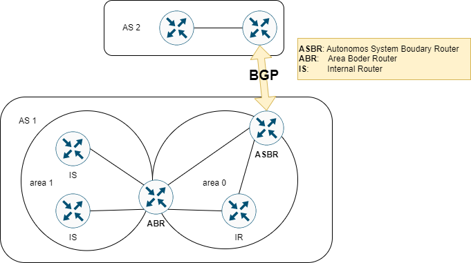
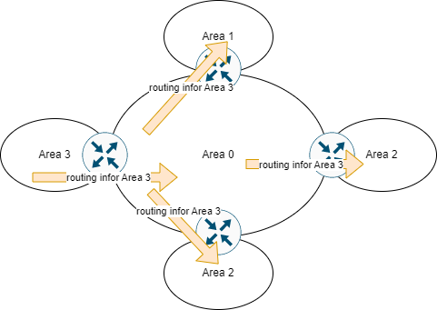
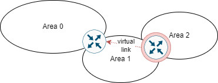

# OPEN SHORT PATH FIRST

## INTRODUCE

OSPF là một giao thức thuộc Network Layer trong mô hình OSI.

OSPF là một giao thức **Link-State** và cũng là là một giao thức **IGP (Interior Gateway Protocol)** dùng để phân phối thông tin định tuyến trong một AS (Autonomous System). Trạng thái của liên kết thì được miêu tả là interface đó và mối quan hệ của nó đối với các router lân cận.

OSPF sử dụng thuật toán Dijkstra để xây dựng và tính toán đường đi ngắn nhất đến **tất cả các đích đến**. Có thể được miêu tả quá trình xây dựng bản định tuyến như sau:

- Bước 1: Khi khởi tạo hoặc có bất kỳ thay đổi nào trong thông tin định tuyến (routing information), router sẽ tạo ra các quảng bá link-state. Các quảng bá này biễu diễn tập hợp các link-state trên router đó.
- Bước 2: Tất cả các router (được cấu hình OSPF) trao đổi các link-state thông qua FLOOD. Mỗi router nhận một cập nhật link-state phải lưu trữ một bản sao trong database và sau đó lan truyền cập nhật link-state đến các router khác.
- Bước 3: Sau khi database của các router đã được hoàn thiện, router sẽ tính toán đường đi ngắn nhất đến **tất cả các đích đến**. Router sử dụng Dijkstra để tính toán cây đường đi ngắn nhất, các điểm đến, chi phí liên quan và next-hop để đến các đích đến đó tạo thành bảng định tuyến IP.
- Bước 4: Trong trường hợp không xảy ra thay đổi trong mạng OSPF, chẳng hạn như chi phí của một liên kết hoặc mạng được thêm hoặc xóa, OSPF vẫn rất yên tĩnh. Các thay đổi được truyền đạt thông qua link-state packet, và thuật toán Dijkstra được tính toán lại để tìm ra đường đi ngắn nhất.

OSPF có administrative-distance là 110.

## AREA VÀ ROUTER BIÊN

Do OSPF sử dụng cơ chế FLOOD để quảng bá các gói tin cập nhật link-state nên điều này có thể dẫn đến bùng nổ của các cập nhật link-state trong mạng. Do đó OSPF có giới thiệu một cơ chế area nhằm tạo ra các ranh giới hay một vùng mà cho cập nhạt link-state.

Router biên (Border Router) là các router kết nối với một vùng khác như là kết nối với vùng mạng AS khác, kết nối với các area khác, kết nối với giao thức định tuyến khác hoặc kết nối với OSPF routing process khác.

- Internal Router (IR): router mà tất cả các interface của nó nằm trong cùng một area.

- Area Border Router (ABR): router có các interface kết nối với các area khác.

- Autonomous System Border Area (ASBR): router có các interface kết nối với các router khác có giao thức định tuyến khác hoặc OSPF routing process khác.

## BACKBONE VÀ AREA 0

Nếu cấu hình OSPF nhiều area, **bắt buộc một trong số đó phải là area 0**. Area 0 còn được gọi là backbone.

Backbone phải ở trung tâm của mạng - tức là tất cả các area khác phải kết nối về mặt vật lý đến nó. Lý do là OSPF mong muốn tất cả các area sẽ đưa thông tin định tuyến vào backbone và đến lượt backbone sẽ phổ biến thông tin đó sang các area khác.

Trong trường hợp nếu như không có một kết nối vật lý nào trực tiếp nào đến area 0 thì cần thực hiện cấu hình một **liên kết ảo**.

## REFERENCE

[1] <https://www.cisco.com/c/en/us/support/docs/ip/open-shortest-path-first-ospf/7039-1.html>

[2] <https://www.ietf.org/rfc/rfc2328.txt>
