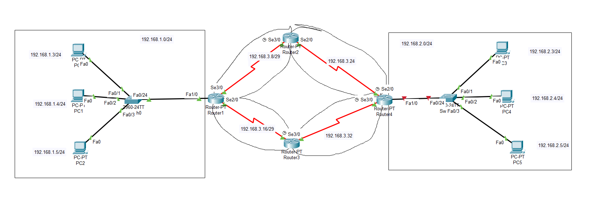
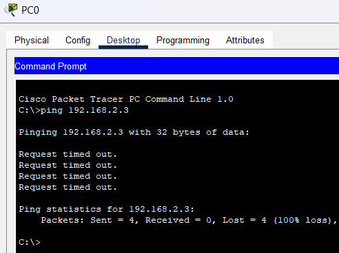
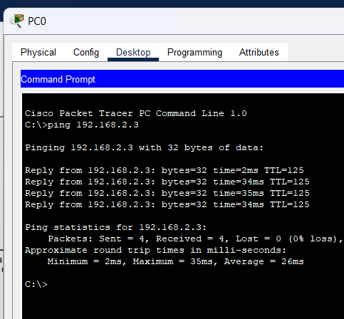

# ROUTING

## OSPF

|Machine|Interface|IP address|Netmask|
|:------|:--------|:---------|:------|
|PC 0|Fa0|192.168.1.3|255.255.255.0|
|PC 1|Fa0|192.168.1.4|255.255.255.0|
|PC 2|Fa0|192.168.1.5|255.255.255.0|
|PC 3|Fa0|192.168.2.3|255.255.255.0|
|PC 4|Fa0|192.168.2.4|255.255.255.0|
|PC 5|Fa0|192.168.2.5|255.255.255.0|
|Router 1|Fa1/0|192.168.1.1|255.255.255.248|
|Router 1|Se2/0|192.168.3.22|255.255.255.248|
|Router 1|Se3/0|192.168.3.14|255.255.255.248|
|Router 2|Se2/0|192.168.3.30|255.255.255.248|
|Router 2|Se3/0|192.168.3.13|255.255.255.248|
|Router 3|Se2/0|192.168.3.21|255.255.255.248|
|Router 3|Se3/0|192.168.3.62|255.255.255.248|
|Router 4|Fa1/0|192.168.2.1|255.255.255.0|
|Router 4|Se2/0|192.168.3.29|255.255.255.248|
|Router 4|Se3/0|192.168.3.61|255.255.255.248|

Cấu hình địa chỉ IP cho các interface như trên.

Cấu hình default gateway cho các máy PC 0, PC 1 và PC 2 là 192.168.1.1 và cho các máy PC 3, PC 4 và PC 5 là 192.168.2.1 .

Sau khi cấu hình xong theo bảng trên, thực hiện ping thử máy ở mạng 192.168.1.0/24 đến một máy ở mạng 192.168.2.0/24. Như đã thấy không thể giao tiếp được khi chưa cấu hình định tuyến.

Thực hiện cấu hình OSPF để các Router có thể định tuyến với nhau với quy tắc là thực hiện quản bá các mạng kết nối trực tiếp với router đó. Thực hiện điều này trên tất cả các Router.

