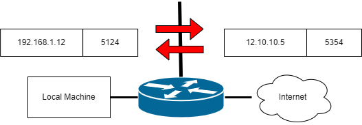

# NETWORK ADDRESS TRANSLATION (NAT)

NAT là một dịch vụ được triển khai trên router hoặc edge platform để kết nối mạng riêng đến mạng công khai chẳng hạn như Internet. Với NAT, một doanh nghiệp chỉ cần một địa chỉ IP để đại diện cho một nhóm các thiết bị khi chúng kết nối bên ngoài Internet. PAT (Port Address Translation) cho phép một địa chỉ IP cho phép một địa chỉ IP có thể dùng chung cho nhiều máy sử dụng chuyển dổi địa chỉ IP và cổng [[1]](https://www.cisco.com/c/en/us/products/routers/network-address-translation.html).

Dựa vào [[2]](https://www.cisco.com/c/en/us/support/docs/ip/network-address-translation-nat/13772-12.html) ta có bốn bước cần thực hiện cấu hình NAT:

1. Xác định NAT inside interface và NAT outside interface.
2. Xác định mục đích của việc sử dụng NAT:
    - Cho phép người dùng bên trong mạng nội bộ truy cập ra bên ngoài internet?
    - Cho phép người dùng bên ngoài truy cập vào tài nguyên bên trong mạng nội bộ (Web Server).
    - Chuyển hướng luồng TCP đến TCP port hay địa chỉ TCP khác.
    - NAT trong quá trình chuyển đổi mạng.
    - Cho phép các mạng chồng chéo lên nhau để giao tiếp.

3. Cấu hình NAT để đạt được các mục đích trên:

    - Static NAT
    - Dynamic NAT
    - Overloading
    - Kết hợp các loại NAT với nhau.

4. Kiểm tra hoạt động của NAT.

## Static NAT

Statis NAT sẽ **chuyển đổi cứng** một địa chỉ riêng thành một địa chỉ công khai [[3]](https://www.cisco.com/c/en/us/td/docs/dcn/nx-os/nexus3548/104x/configuration/interfaces/cisco-nexus-3548-nx-os-interfaces-configuration-guide-104x/m-configruing-static-and-dynamic-nat-translation.html).

## Dynamic NAT

Dynamic NAT thiết lập ánh xạ một-một giữa các địa chỉ IP chưa đăng ký và các địa chỉ IP đã đăng ký; tuy nhiên, các ánh xạ này có thể khác nhau tùy thuộc vào địa chỉ IP đã đăng ký còn lại tại thời điểm kết nối. Dynamic NAT như một tường lửa giữa mạng nội bộ và mạng công khai hay Internet mà nó chỉ cho phép các kết nối được khởi tạo từ mạng bên trong ra bên ngoài. Bản dịch dymanic NAT sẽ không tồn tại trong bảng dịch NAT cho đến khi thiết bị nhận được lưu lượng mà yêu cầu dịch. Các bản dịch sẽ tồn tại tạm thời cho đến khi được xóa hoặc hết thời gian nhằm chừa các IP cho các kết nối khác [[3]](https://www.cisco.com/c/en/us/td/docs/dcn/nx-os/nexus3548/104x/configuration/interfaces/cisco-nexus-3548-nx-os-interfaces-configuration-guide-104x/m-configruing-static-and-dynamic-nat-translation.html).

## Sự khác biệt giữa Static NAT và Dynamic NAT

Sự khác biệt chính giữa dynamic NAT và static NAT là static NAT cho phép máy chủ từ xa bắt đầu kết nối với máy chủ đã dịch nếu tồn tại ACL cho phép điều đó, trong khi dynamic NAT thì không [[3]](https://www.cisco.com/c/en/us/td/docs/dcn/nx-os/nexus3548/104x/configuration/interfaces/cisco-nexus-3548-nx-os-interfaces-configuration-guide-104x/m-configruing-static-and-dynamic-nat-translation.html), vì vậy static NAT phù hợp cho việc cấu hình một máy mà cho các người dùng bên ngoài mạng truy cập vào tài nguyên trong mạng nội bộ như Web Server, trong khi đó dynamic NAT sẽ phù hợp cho việc cấu hình cho các user từ mạng bên trong muốn truy cập ra bên ngoài bằng một địa chỉ IP có thể được định tuyến.

## REFERENCE

[1] <https://www.cisco.com/c/en/us/products/routers/network-address-translation.html>

[2] <https://www.cisco.com/c/en/us/support/docs/ip/network-address-translation-nat/13772-12.html>

[3] <https://www.cisco.com/c/en/us/td/docs/dcn/nx-os/nexus3548/104x/configuration/interfaces/cisco-nexus-3548-nx-os-interfaces-configuration-guide-104x/m-configruing-static-and-dynamic-nat-translation.html>
