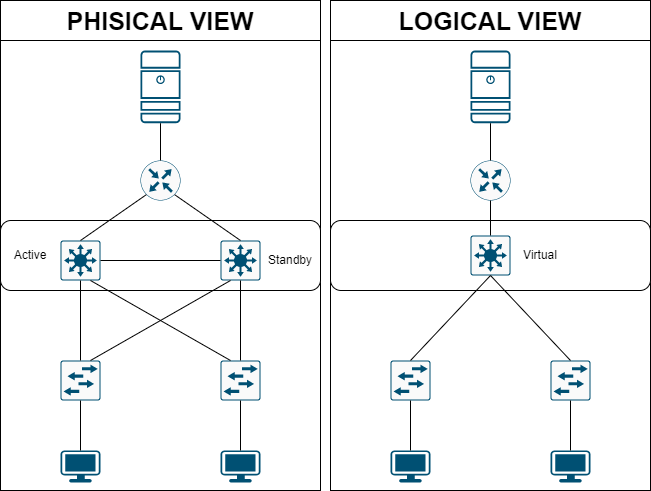
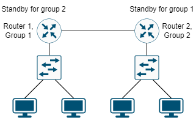

# HOT STANDBY ROUTER PROTOCOL

## DEFINITION

Là giao thức cung cấp tính sẵn sàng cao (High Availability) cho cho mạng. HSRP cho phép một tập các router interface hoạt động cùng nhau để biễu diễn như là một router ảo hoặc là default gateway duy nhất cho các host trong mạng LAN. Khi cấu hình HSRP trên một mạng hoặc một phân đoạn nó sẽ cung cấp một **Media Access Address (MAC) ảo** và một **địa chỉ IP ảo** mà nó được chi sẻ giữa một nhóm các router được cấu hình, cho phép các router được cấu hình HSRP có thể sử dụng địa chỉ MAC và địa chỉ IP ảo của Router ảo này [[1]](https://www.cisco.com/c/en/us/support/docs/ip/hot-standby-router-protocol-hsrp/9234-hsrpguidetoc.html).

Một trong các routers sẽ được bầu làm **Active Router** và còn lại sẽ là **Standby Router**. Standby Router đảm nhận quyền kiểm soát địa chỉ MAC và địa chỉ IP của nhóm nếu Active Router bị lỗi [[1]](https://www.cisco.com/c/en/us/support/docs/ip/hot-standby-router-protocol-hsrp/9234-hsrpguidetoc.html).

## HSRP EXAMPLE

Hình trên biễu diễn hoạt động HSRP trong mạng có 1 VLAN. Khi cấu hình HSRP cho 2 switch Active và Standby thì 2 switch này sẽ chia sẻ và sử dụng chung cặp địa chỉ MAC và địa chỉ IP ảo và tồn tại như một thiết bị ảo duy nhất, và các host sẽ nhận defaut gateway IP là địa chỉ của thiết bị ảo đó.

## MULTIPLE HSRP AND EXAMPLE

Cisco IOS phiên bản 12.2(18)SE trở lên hỗ trợ Multiple HSRP (MHSRP), một phiên bản mở rộng của  HSRP cho phép chia sẻ tải giữa hai hay nhiều nhóm HSRP với nhau. Việc cấu hình MHSRP có thể đạt đến load balancing và sử dụng hai nhay nhiều nhóm dự phòng từ một mạng host đến mạng server.

## RERERENCE

[1] <https://www.cisco.com/c/en/us/td/docs/switches/lan/catalyst3560/software/release/12-2_25_se/configuration/guide/3560scg/swhsrp.pdf>

[2] <https://www.cisco.com/c/en/us/support/docs/ip/hot-standby-router-protocol-hsrp/9234-hsrpguidetoc.html>
