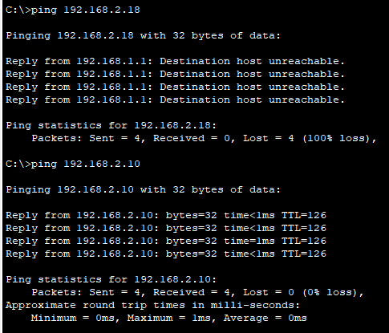

# ACCESS CONTROL LIST example


**Yêu cầu**:

- Google Server là một web server (chỉ bật HTTP và HTTPS).
- Fshare Server là một file server (chỉ bật FTP và TFTP).
- Các Router định tuyến bằng OSPF, xem lại cách cấu hính OSPF tại [đây](../OSPF_routing/index.md).

Địa chỉ các máy được cấu hình theo quy ước như sau:

|Machine|Interface|IP address|Netmask|
|:-----|:----|:-----------|:--------------|
|PC 0  |Fa0  |192.168.1.4 |255.255.255.0  |
|PC 1  |Fa0  |192.168.1.5 |255.255.255.0  |
|R1    |Gi0/0|192.168.2.1 |255.255.255.0  |
|R1    |Gi0/1|192.168.2.6 |255.255.255.248|
|R2    |Gi0/0|192.168.2.5 |255.255.255.248|
|R2    |Gi0/1|192.168.2.14|255.255.255.248|
|R2    |Gi0/2|192.168.2.22|255.255.255.248|
|Google|Fa0  |192.168.2.10|255.255.255.248|
|Fshare|Fa0  |192.168.2.18|255.255.255.248|

**YC1**: Tạo một ACL mà sao cho các máy trong mạng 192.168.1.0/24 không được kết nối đến Fshare Server để thực tải tệp.

**YC2**: Bổ sung ACL mới vào ACL nhằm chặn việc ping từ máy trong mạng 192.168.1.0/24 không kết nối được đến Fshare Server.

**YC3**: Xóa bản ACL mà cấm ping đền Fshare Server.

**YC4**: Xóa luôn ACL đã tạo.

## YC1

Bước 1: Thiết lập ACL có ACL number là 102 [[2]](https://www.ciscopress.com/articles/article.asp?p=1697887), cấu hình Extend ACL tham khảo tại [[1]](https://www.cisco.com/c/en/us/support/docs/security/ios-firewall/23602-confaccesslists.html#toc-hId-1966246354)

```
access-list 102 deny tcp 192.168.1.0 0.0.0.255 host 192.168.2.18 eq ftp
access-list 102 permit ip any any
```

Kiểm tra access list bằng `show access-list`.


Bước 2: chỉ định interface Gi0/0 chặn kết nối từ bên trong.

```
interface gi0/0
ip access-group 102 in
```

## YC2

Phương pháp để sửa đối ACL đọc tại [[1]](https://www.cisco.com/c/en/us/support/docs/security/ios-firewall/23602-confaccesslists.html#toc-hId-1482701489).

Kiểm tra ping đến Web server và FTP server trước khi thêm rule mới. Như đã thấy mặc dù không thực hiện giao thức FTP được nhưng máy trong mạng nội bộ vẫn còn ping được đến FTP server.


```
ip access-list extended 102
15 deny icmp 192.168.1.0 0.0.0.255 host 192.168.2.18
```

Dùng `show access-lists` để kiểm tra.


Kiểm tra ping đến Web server và FTP server sau khi thêm rule mới. Như đã thầy máy trong mạng nội bộ không còn ping đến FTP server nữa.



## YC3


Dùng các lệnh sau để xóa rule thứ 20 của ACL là rule cần xóa.

```
ip access-list extended 102
no 20 deny icmp 192.168.1.0 0.0.0.255 host 192.168.2.18
end
```

Dùng `show access-lists` để kiểm tra ACL:


## YC4

Dùng `no access-list 102` để xóa bỏ ACL 102:

Dùng `show access-lists` để kiểm tra ACL:


## REFERENCE

[1] <https://www.cisco.com/c/en/us/support/docs/security/ios-firewall/23602-confaccesslists.html>

[2] <https://www.ciscopress.com/articles/article.asp?p=1697887>
