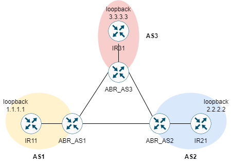

# BORDER GATEWAY PROTOCOL CONFIGURATION



Cấu hình BGP cho các AS có thể giao tiếp với nhau, đảm bảo các địa chỉ loopback có thể giao tiếp với nhau.

## CÁC BƯỚC CẤU HÌNH

Cấu hình các địa chỉ IP cho các thiết bị mạng:

|Machine|Interface|IP address|Netmask|IP Gateway|
|:------|:--------|:---------|:------|:---------|
|ABR_AS1|gi0/0|10.0.1.1|255.255.255.0|#|
|ABR_AS1|gi0/1|13.13.13.14|255.255.255.0|#|
|ABR_AS1|gi0/2|12.12.12.14|255.255.255.0|#|
|IR11|gi0/0|10.0.1.2|255.255.255.0|#|
|IR11|loopback 0|1.1.1.1|255.255.255.255|#|
|ABR_AS2|gi0/0|10.0.2.1|255.255.255.0|#|
|ABR_AS2|gi0/1|13.13.13.15|255.255.255.0|#|
|ABR_AS2|gi0/2|14.14.14.14|255.255.255.0|#|
|IR21|gi0/0|10.0.2.2|255.255.255.0|#|
|IR21|loopback 0|2.2.2.2|255.255.255.255|#|
|ABR_AS3|gi0/0|10.0.3.1|255.255.255.0|#|
|ABR_AS3|gi0/1|14.14.14.15|255.255.255.0|#|
|ABR_AS3|gi0/2|12.12.12.15|255.255.255.0|#|
|IR31|gi0/0|10.0.3.2|255.255.255.0|#|
|IR31|loopback 0|3.3.3.3|255.255.255.0|#|

Cấu hình OSPF cho các AS, đảm bảo loopback có thể ping tới ABR:

- Tại router ABR_AS1:

```
interface gi0/0
ip ospf 1 area 0
```

- Tại router IR11:

```
router ospf 1
network 0.0.0.0 255.255.255.255 area 0
```

- Tại router ABR_AS2:

```
interface gi0/0
ip ospf 1 area 0
```

- Tại router IR21:

```
router ospf 1
network 0.0.0.0 255.255.255.255 area 0
```

- Tại router ABR_AS3:

```
interface gi0/0
ip ospf 1 area 0
```

- Tại router IR31:

```
router ospf 1
network 0.0.0.0 255.255.255.255 area 0
```

Cấu hình BRP cho các AS, để các máy trong AS có thể giao tiếp với nhau:

- Tại ABR_AS1

```
router bgp 1
neighbor 13.13.13.15 remote-as 2
neighbor 12.12.12.15 remote-as 3
network 2.2.2.2 mask 255.255.255.255
exit
```

- Tại IR11:

```
router bgp 1
```

- Tại ABR_AS2:

```
router bgp 2
neighbor 13.13.13.14 remote-as 1
neighbor 14.14.14.15 remote-as 3
network 2.2.2.2 area 255.255.255.255
exit
```

- Tại IR21:

```
router bgp 2
```

- Tại ABR_AS3:

```
router bgp 3
neighbor 12.12.12.14 remote-as 1
neighbor 14.14.14.14 remote-as 2
network 3.3.3.3 mask 255.255.255.255
```

- Tại IR31:

```
router bgp 3
```

## REFERENCE

[1] <https://waren.vn/chuyen-de/cau-hinh-co-ban-bgp-voi-cisco-ios.html>
