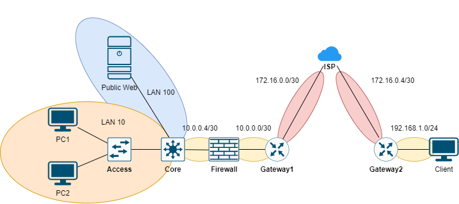

# FIREWALL

Thực hiện xây dựng mô hình mạng như hình trên.

## CÁC BƯỚC CÂÚ HÌNH

|Machine|Interface|IP address|Netmask|IP Gateway|
|:------|:--------|:---------|:------|:---------|
|Gateway 1|Gig0/0/0|10.0.0.1|255.255.255.252|#|
|Gateway 1|Se0/1/0|172.16.0.2|255.255.255.252|#|
|Firewall|gig1/0|10.0.0.2|255.255.255.252|#|
|Firewall|gig1/1|10.0.0.5|255.255.255.252|#|
|Core|gig1/0/1|10.0.0.6|255.255.255.252|#|
|Core|VLAN 100|10.0.100.254|255.255.255.0|#|
|Core|VLAN 10|10.0.10.254|255.255.255.0|#|
|Web Server|Fa0|10.0.100.15|255.255.255.0|10.0.100.254|
|PC1|Fa0|10.0.10.15|255.255.255.0|10.0.10.254|
|PC2|Fa0|10.0.10.16|255.255.255.0|10.0.10.254|
|ISP|Se0/1/0|172.16.0.1|255.255.255.252|#|
|ISP|Se0/1/1|172.16.0.5|255.255.255.252|#|
|Gateway 2|Se0/1/0|172.16.0.6|255.255.255.252|#|
|Gateway 2|Gig0/0/0|192.168.1.254|255.255.255.0|#|
|Client|Fa0|192.168.1.15|255.255.255.0|192.168.1.254|

## REFERENCE
