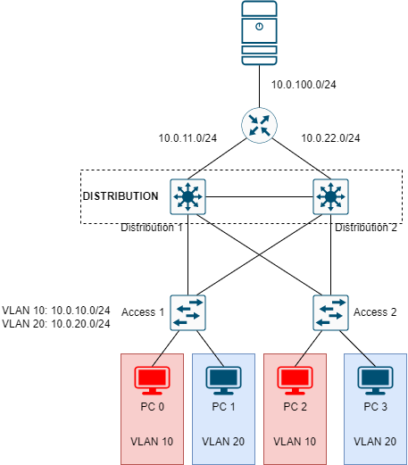

# HSRP CONFIGURATION EXAMPLE



Cấu hình mô hình mạng như hình trên. Với các yêu cầu sau:

- Switch *Distribution 1* là gateway chính chính cho VLAN 10, và gateway phụ cho VLAN 20.
- Switch *Distribution 2* là gateway chính chính cho VLAN 20, và gateway phụ cho VLAN 10.
- Đảm bảo nếu một trong 2 gateway gặp sự cố thì các máy vẫn ping đến được server.


## CÁC BƯỚC CẤU HÌNH

**Địa chỉ IP cho ác interface**:

|Machine|Interface|IP address|Netmask|Gateway|
|:------|:--------|:---------|:------|:------|
|Router|Gi0/0|10.0.100.15|255.255.255.0|10.0.100.1|
|Router|Gi0/1|10.0.11.5|255.255.255.0|#|
|Router|Gi0/2|10.0.12.5|255.255.255.0|#|
|Distribution 1|gi1/0/4|10.0.11.6|255.255.255.0|#|
|Distribution 1|VLAN 10|10.0.10.2|255.255.255.0|#|
|Distribution 1|virtual gateway VLAN 10|10.0.10.1|255.255.255.0|#|
|Distribution 1|VLAN 20|10.0.10.2|255.255.255.0|#|
|Distribution 1|virtual gateway VLAN 20|10.0.20.1|255.255.255.0|#|
|Distribution 2|gi1/0/4|10.0.12.6|255.255.255.0|#|
|Distribution 2|VLAN 10|10.0.10.3|255.255.255.0|#|
|Distribution 2|virtual gateway VLAN 10|10.0.10.1|255.255.255.0|#|
|Distribution 2|VLAN 20|10.0.20.3|255.255.255.0|#|
|Distribution 2|virtual gateway VLAN 20|10.0.20.1|255.255.255.0|#|
|PC 0|Fa0|10.0.10.5|255.255.255.0|10.0.10.1 (virtual gateway VLAN 10)|
|PC 1|Fa0|10.0.20.5|255.255.255.0|10.0.20.1 (virtual gateway VLAN 20)|
|PC 2|Fa0|10.0.10.6|255.255.255.0|10.0.10.1 (virtual gateway VLAN 10)|
|PC 3|Fa0|10.0.20.6|255.255.255.0|10.0.20.1 (virtual gateway VLAN 20)|

**VLAN ID, Standby ID, địa chỉ IP**:

|VLAN|Standby Group|Virtual IP address|
|:---|:------------|:-----------------|
|1|1|10.0.1.1|
|10|10|10.0.10.1|
|20|20|10.0.20.1|

**Cấu hình *Router***:

- Cấu hình địa chỉ IP:

```
en
conf ter
interface gi0/0
ip address 10.0.100.1 255.255.255.0
no shut
exit
interface gi0/1
ip address 10.0.11.5 255.255.255.0
no shut
exit
interface gi0/2
ip address 10.0.12.5 255.255.255.0
no shut
exit
```

- Cấu hình static route sao cho Router biết được gói tin thuộc về VLAN 10 đến từ interface kết nối trực tiếp có địa chỉ IP là 10.0.11.6 (gi1/0/4 của *Distribution 1*) và gói tin thuộc VLAN 20 đến từ interface kết nối trực tiếp có địa chỉ IP là 10.0.12.6 (gi1/0/4 của *Distribution 2*):

```
ip route 10.0.10.0 255.255.255.0 10.0.11.6 10
ip route 10.0.10.0 255.255.255.0 10.0.12.6 20
ip route 10.0.20.0 255.255.255.0 10.0.12.6 10
ip route 10.0.20.0 255.255.255.0 10.0.11.6 20
```

**Cấu hình *Distribution 1***:

- Cấu hình địa chỉ IP cho interface kết nối với *Router*:

```
en
conf ter
interface gi1/0/4
no switchport
ip address 10.0.11.6 255.255.255.0
no shut
exit
```

- Tạo các VLAN và gán địa chỉ IP cho các VLAN:

```
vlan 10
exit
interface vlan 10
ip address 10.0.10.2 255.255.255.0
exit
vlan 20
exit
interface vlan 20
ip address 10.0.20.2 255.255.255.0
exit
```

- Cấu hình trunk port cho các cổng kết nối với *Access 1*, *Access 2* và *Distribution 2*

```
interface range gi1/0/1-3
switchport mode trunk
exit
```

- Bật tính năng routing:

```
ip routing
```

- Cấu hình default-route:

```
ip route 0.0.0.0 0.0.0.0 10.0.11.5
```

- Cấu hình HSRP, và gán priority cao (105 > 100) cho VLAN 10, và sử dụng pritority mặc định cho VLAN 20 (giá trị priority khi cấu hình HSRP là 100 [[1]](https://www.cisco.com/c/en/us/td/docs/switches/lan/catalyst3560/software/release/12-2_25_se/configuration/guide/3560scg/swhsrp.pdf)):

```
interface vlan 10
standby 10 ip 10.0.10.1
standby 10 priority 105
standby 10 track gi1/0/4
exit
interface vlan 20
standby 20 ip 10.0.20.1
standby 20 preempt
exit
```

- Cấu hình STP, sao cho VLAN 10 của *Distribution 1* là primary root và là secondary root cho VLAN 20:

```
spanning-tree vlan 10 root primary
spanning-tree vlan 20 root secondary
end
```

**Cấu hình *Distribution 2***:

- Cấu hình địa chỉ IP cho interface kết nối với Router:

```
en
conf ter
inteface gi1/0/4
no switchport
ip address 10.0.12.6 255.255.255.0
no shut
exit
```

- Tạo các VLAN và gán các địa chỉ IP cho các VLAN:

```
vlan 10
exit
interface vlan 10
ip address 10.0.10.3 255.255.255.0
exit
vlan 20
exit
interface vlan 20
ip address 10.0.20.3 255.255.255.0
exit
```

- Cấu hình trunk port cho các cổng kết nối với *Access 1*, *Access 2* và *Distribution 2*

```
interface range gi1/0/1-3
switchport mode trunk
exit
```

- Bật tính năng routing:

```
ip routing
```

- Cấu hình default-route:

```
ip route 0.0.0.0 0.0.0.0 10.0.11.6
```

- Cấu hình HSRP, cấu hình cho VLAN 10 có priority là mặc định và VLAN 20 có priority cao hơn là 105:

```
interface vlan 10
standby 10 ip 10.0.10.1
standby 10 preempt
exit
interface vlan 20
standby 20 ip 10.0.20.1
standby 20 priority 105
standby 20 track gi1/0/4
exit
```

- Cấu hình STP, sao cho VLAN 10 là secondary root cho *Distribution 2* và VLAN 20 là primary root:

```
spanning-tree vlan 10 root secondary
spanning-tree vlan 20 root primary
end
```

**Cấu hình *Access 1***:

- Tạo VLAN trên swich *Access 1*:
 
```
en
conf ter
vlan 10
exit
vlan 20
exit
```

- Gán cổng trunk cho các interface kết nối với *Distribution 1* và *Distribution 2*:

```
interface range f0/1-2
switchport mode trunk
exit
```

- Gán VLAN cho các port tương ứng:

```
interface fa0/23
switchport mode access
switchport access vlan 10
exit
interface fa0/24
switchport mode access
switchport access vlan 20
end
```

**Cấu hình *Access 2***:

```
en
conf ter
vlan 10
exit
vlan 20
exit
```

- Gán cổng trunk cho các interface kết nối với *Distribution 1* và *Distribution 2*:

```
interface range f0/1-2
switchport mode trunk
exit
```

- Gán VLAN cho các port tương ứng:

```
interface fa0/23
switchport mode access
switchport access vlan 10
exit
interface fa0/24
switchport mode access
switchport access vlan 20
end
```

## REFERENCE

[1] <https://www.cisco.com/c/en/us/td/docs/switches/lan/catalyst3560/software/release/12-2_25_se/configuration/guide/3560scg/swhsrp.pdf>

[2] <https://www.cisco.com/c/en/us/support/docs/ip/hot-standby-router-protocol-hsrp/9234-hsrpguidetoc.html>

[3] <https://securityzone.vn/t/lab-7-0-cau-hinh-hsrp-cisco.2749/>
