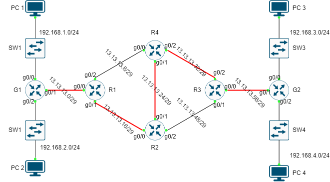

# MPLS example

Thực hiện cấu hình MPLS để cho luồng mạng di chuyển từ PC 3 đến PC1 theo đường dẫn đã chỉ định.

## BƯỚC CẤU HÌNH

### GÁN ĐỊA CHỈ IP

|Machine|Interface|IP address|Netmask|Gateway|
|:------|:--------|:---------|:------|:------|
|PC 1|Fa0|192.168.1.10|255.255.255.0|192.168.1.254|
|PC 2|Fa0|192.168.2.10|255.255.255.0|192.168.2.254|
|PC 3|Fa0|192.168.3.10|255.255.255.0|192.168.3.254|
|PC 4|Fa0|192.168.4.10|255.255.255.0|192.168.4.254|
|G1|g0/0|192.168.1.254|255.255.255.0|N/A|
|G1|g0/1|13.13.13.6|255.255.255.248|N/A|
|G1|g0/2|192.168.2.254|255.255.255.0|N/A|
|R1|g0/0|13.13.13.5|255.255.255.248|N/A|
|R1|g0/1|13.13.13.22|255.255.255.248|N/A|
|R1|g0/2|13.13.13.14|255.255.255.248|N/A|
|R2|g0/0|13.13.13.21|255.255.255.248|N/A|
|R2|g0/1|13.13.13.30|255.255.255.248|N/A|
|R2|g0/2|13.13.13.54|255.255.255.248|N/A|
|R3|g0/0|13.13.13.62|255.255.255.248|N/A|
|R3|g0/1|13.13.13.53|255.255.255.248|N/A|
|R3|g0/2|13.13.13.38|255.255.255.248|N/A|
|R4|g0/0|13.13.13.13|255.255.255.248|N/A|
|R4|g0/1|13.13.13.29|255.255.255.248|N/A|
|R4|g0/2|13.13.13.37|255.255.255.248|N/A|
|G2|g0/0|192.168.3.254|255.255.255.0|N/A|
|G2|g0/1|13.13.13.61|255.255.255.248|N/A|
|G2|g0/2|192.168.4.254|255.255.255.0|N/A|

### CẤU HÌNH OSPF ROUTING

Thực hiện cấu hình OSPF routing, tham khảo tại [đây](../OSPF_routing/index.md), sử dụng OSPF id là 1 và area là 0.

### CẤU HÌNH MPLS

### KIỂM TRA

## REFERENCE

[1] <https://www.cisco.com/c/en/us/td/docs/ios-xml/ios/mp_basic/configuration/xe-16/mp-basic-xe-16-book/multiprotocol-label-switching-mpls-on-cisco-routers.html>
