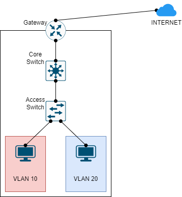

# NAT TRONG MẠNG NHIỀU VLAN



Cấu hình NAT cho máy ở VLAN 10 và VLAN 20 giao tiếp với INTERNET (8.8.8.8) bằng địa chỉ 8.8.8.1

## CÁC BƯỚC CẤU HÌNH

**Cấu hình địa chỉ IP**:

|Machine|Interface|IP address|Netmask|Gateway|
|:------|:--------|:---------|:------|:------|
|INTERNET|gi0/1|8.8.8.8|255.0.0.0|#|
|Gateway|gi0/1|8.8.8.1|255.0.0.0|#|
|Gateway|gi0/0|10.0.1.1|255.255.255.0|#|
|Gateway|gi0/0.10|10.0.10.1|255.255.255.0|#|
|Gateway|gi0/0.20|10.0.20.1|255.255.255.0|#|
|Core|VLAN 1|10.0.1.2|255.255.255.0|#|
|Core|VLAN 10|10.0.10.2|255.255.255.0|#|
|Core|VLAN 20|10.0.20.2|255.255.255.0||
|PC 1|Fa0|10.0.10.5|255.255.255.0|10.0.10.1|
|PC 2|Fa0|10.0.20.5|255.255.255.0|10.0.20.1|

**Cấu hình INTERNET**:

```
en
conf ter
interface gi0/1
ip address 8.8.8.8 255.0.0.0
no shut
exit
```

**Cấu hình Gateway**:

- Cấu hình địa chỉ IP cho interface đối mặt với INTERNET:

```
en
conf ter
interface gi0/1
ip address 8.8.8.1 255.0.0.0
no shut
exit
```

- Cấu hình các subinterface cho Interface ở mạng nội bộ:

```
interface gi0/0
ip address 10.0.1.1 255.255.255.0
no shut
exit
interface gi0/0.10
encapsulation dot1q 10
ip address 10.0.10.1 255.255.255.0
no shut
exit
interface gi0/0.20
encapsulation dot1q 20
ip address 10.0.20.1 255.255.255.0
no shut
exit
```

- Cấu hình NAT:

```
interface gi0/1
ip nat outside
exit
interface gi0/0
ip nat inside
exit
interface gi0/0.10
ip nat inside
exit
interface gi0/0.20
ip nat inside
exit
ip nat pool NAT_POOL 8.8.8.1 8.8.8.1 netmask 255.0.0.0
access-list 1 permit 10.0.1.0 0.0.0.255
access-list 1 permit 10.0.10.0 0.0.0.255
access-list 1 permit 10.0.20.0 0.0.0.255
ip nat inside source list 1 pool NAT_POOL overload
```

**Cấu hình Core Switch**:

- Cấu hình Core Switch là một VTP server có domain là InSec:

```
en
conf ter
vtp domain InSec
vtp mode server
```

- Tạo VLAN 10 và 20:

```
vlan 10
exit
vlan 20
exit
```

- Gán địa chỉ IP cho các VLAN:

```
interface vlan 1
ip address 10.0.1.2 255.255.255.0
exit
interface vlan 10
ip address 10.0.10.2 255.255.255.0
exit
interface vlan 20
ip address 10.0.20.2 255.255.255.0
exit
```

- Bật chức năng routing:

```
ip routing
```

- Cấu hình trunk port với các port kết nối với Gateway và Access:

```
interface gi1/0/2
switchport mode trunk
exit
interface gi1/0/1
switchport mode trunk
exit
```

**Cấu hình Access Switch**:

- Cấu hình VTP client thuộc VTP domain InSec:

```
vtp domain InSec
vtp mode client
```

- Cấu hình access port tương ứng với VLAN:

```
interface fa3/1
switchport mode access
swichport access vlan 10
exit
interface fa2/1
switchport mode access
switchport access vlan 20
```

## REFERENCE
