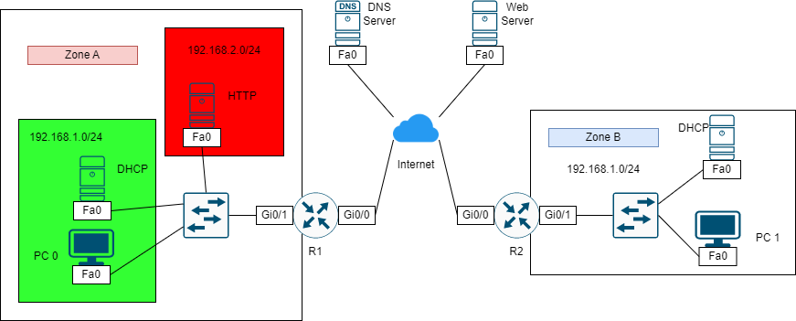

# CẤU HÌNH NAT CHO MỘT DOANH NGHIỆP



**Yêu cầu:**

Cấu hình mạng có kiến trúc như hình, đảm bảo các user trong mạng nội bộ có thể giao tiếp với DNS server và Web Server.

Ở mạng nội bộ Zone A, PC 0 có thể truy cập đến DNS server và Web server. Server cung cấp dịch vụ DHCP và HTTP/HTTPS. Router R1 thực hiện dynamic NAT để máy PC 0 truy cập Internet bằng một IP công khai. Router R1 cũng thực hiện static NAT cho HTTP server có một địa chỉ IP công khai, DNS server sẽ lưu địa chỉ công khai của HTTP server này.

Mạng nội bộ Zone B PC 1 có thể truy cập đến DNS Server, Web Server và HTTP Server của Zone A. Server cung cấp dịch vụ DHCP. Router R2 thực hiện dynamic NAT để máy PC 1 truy cập Internet bằng một IP công khai.

## Bước cấu hình

### CÀI ĐẶT ĐỊA CHỈ IP

Thực hiện cấu hình các interface như sau, dùng địa chỉ mạng là 8.8.8.0/24 để mô phỏng mạng Internet. Cấu hình subinterface xem tại [[2]](https://www.cisco.com/c/en/us/td/docs/switches/lan/catalyst9600/software/release/17-3/configuration_guide/vlan/b_173_vlan_9600_cg/configuring_layer_3_subinterfaces.pdf).

|Machine|Interface|IP address|Netmask|
|:------|:--------|:---------|:------|
|DNS Server|Fa0|8.8.8.8|255.255.255.0|
|Web Server|Fa0|8.8.8.9|255.255.255.0|
|R1|Gig0/0|8.8.8.100|255.255.255.0|
|R1|Gig0/1.1|192.168.10.100|255.255.255.0|
|R1|Gig0/1.2|192.168.20.100|255.255.255.0|
|R2|Gig0/0|8.8.8.101|255.255.255.0|
|R2|Gig0/1|192.168.1.1|255.255.255.0|
|Internal DHCP Server (Zone A)|Fa0|192.168.10.2|255.255.255.0|
|Internal Web Server (Zone A)|Fa0|192.168.20.50|255.255.255.0|
|Internal DHCP Server (Zone B)|Fa0|192.168.10.2|255.255.255.0|

### MÔ PHỎNG INTERNET

Cấu hình định tuyến OSPF cho các Gateway 1, Gateway 2 và Internet (L3 switch). Tham khảo cách cấu hình OSPF tại [đây](../OSPF_routing/index.md). Lưu ý rằng 2 router Gateway sẽ không quản bá mạng nội bộ ra Internet.

### CẤU HÌNH DYNAMIC NAT VÀ STATIC NAT CHO ZONE A

**Định nghĩa ACL chỉ cho phép từ bên ngoài truy cập dến web server và thực hiện ping. Trong khi đó mạng nội bộ có thể ra vào Internet bình thường:**

- Tạo Access List sao cho tỏa yêu cầu:

```
access-list 102 permit ospf any any
access-list 102 permit tcp any host 13.13.13.13 eq 80
access-list 102 permit tcp host 13.13.13.13 any eq 80
access-list 102 permit icmp any host 13.13.13.13
access-list 102 permit icmp host 13.13.13.13 any
```

- Áp dụng Access List lên Interface g0/0 theo chiều vào:

```
ip access-group 102 in
```

**Cấu hình static NAT cho Zone A để các máy ở Zone B truy cập Web ở Zone A bằng địa chỉ 13.13.13.13:**

- Xác định NAT interface outside là g0/0 và inside là g0/1.1 và g0/1.2:

```
interface g0/0
ip nat outside
interface g0/1.1
ip nat inside
interface g0/1.2
ip nat inside
```

- Tạo một bản NAT định nghĩa chuyển đổi giữa IP 12.12.12.12 thành 192.168.20.2 (IP Internal Web Server của Zone A):

```
ip nat inside source static 192.168.20.2 13.13.13.13
```

**Cấu hình Dynamic NAT cho các máy ở Zone A có thể truy cập Internet bình thường với địa chỉ IP công khai là 13.13.13.14:**

- Tạo IP NAT pool cho các máy ở Zone A có thể kết nối với Internet.

```
ip nat pool ZONE_A 13.13.13.14 13.13.13.15 netmask 255.255.255.0
```

- Tạo ACL để cho biết interface traffic có thể dịch được, do mạng Zone A có 2 mạng là 192.168.10.0/24 và 192.168.20.0/24 nên là ACL sẽ có 2 dòng:

```
access-list 1 permit 192.168.10.0 0.0.0.255
access-list 1 permit 192.168.20.0 0.0.0.255
```

- Áp dụng PAT:

```
ip nat inside source list 1 pool ZONE_A overload
```

### CẤU HÌNH DYNAMIC NAT CHO ZONE B

**Cấu hình Dynamic NAT cho các máy ở Zone A có thể truy cập Internet bình thường với địa chỉ IP công khai là 13.13.13.14:**

- Xác định NAT interface outside là g0/0 và inside là g0/1.1 và g0/1.2:

```
interface g0/0
ip nat outside
interface g0/1
ip nat inside
```

- Tạo IP NAT pool cho các máy ở Zone A có thể kết nối với Internet.

```
ip nat pool ZONE_B 17.17.17.17 17.17.17.17 netmask 255.255.255.0
```

- Tạo ACL để cho biết interface traffic có thể dịch được, do mạng Zone A có 2 mạng là 192.168.10.0/24 và 192.168.20.0/24 nên là ACL sẽ có 2 dòng:

```
access-list 1 permit 192.168.1.0 0.0.0.255
```

- Áp dụng PAT:

```
ip nat inside source list 1 pool ZONE_B overload
```

## REFERENCE

[1] <https://www.cisco.com/c/en/us/support/docs/ip/network-address-translation-nat/13772-12.html>
