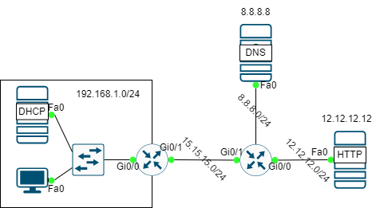

# DYNAMIC NAT



**Yêu cầu:**

Cấu hình để các máy trong mạng truy cập ra internet với địa chỉ IP public trong khoảng 15.15.15.15 đến 15.15.15.20. Cấu hình máy Server trong mạng nội bộ nhận DNS server là 8.8.8.8.

## CẤU HÌNH NAT

**Xác định NAT inside và NAT outside cho Router Gateway**:

- Interface NAT inside:

```
interface gigabitEthernet 0/0
ip nat inside
```

- Interface NAT outside:

```
interface gigabitEthernet 0/1
ip nat outside
```

**Tạo NAT pool có tên là NAT_POOL** - danh sách các địa chỉ IP sẽ được ánh xạ có thể có cho địa chỉ IP riêng tư:

- Chỉ một địa chỉ IP được dịch (lưu ý nếu dùng duy nhất 1 địa chỉ IP thì bước cuối cung thực thi NAT phải chọn các NAT Overload/PAT):

```
ip nat pool NAT_POOL 15.15.15.15 15.15.15.15 netmask 255.255.255.0
```

- Có nhiều hơn một địa chỉ IP (ví dụ trường hợp này là 5):

```
ip nat pool NAT_POOL 15.15.15.15 15.15.15.20 netmask 255.255.255.0
```

**Tạo ACL cho để biết internal traffic có thể được dịch**. Dựa theo yêu cầu ta cần NAT mạng 192.168.1.0/24 ra Internet.

```
access-list 1 permit 192.168.1.0 0.0.0.255
```

**Áp dụng NAT với ACL và NAT_POOL đã cấu hình**. Đọc thêm *Configure NAT to Allow Internal Users to Access the Internet with Overload* tại [[1]](https://www.cisco.com/c/en/us/support/docs/ip/network-address-translation-nat/13772-12.html).

- Cấu hình mỗi IP private tương ứng với một IP public:
```
ip nat inside source list 1 pool NAT_POOL
```

- Hoặc là PAT, cho phép nhiều địa chỉ IP private trên nhiều thiết bị khác nhau có thể được dịch thành một địa chỉ IP duy nhất.

```
ip nat inside source list 1 pool NAT_POOL overload
```

## RERFERENCE

[1] <https://www.cisco.com/c/en/us/support/docs/ip/network-address-translation-nat/13772-12.html>

[2] <https://www.geeksforgeeks.org/dynamic-nat-configuration-in-cisco/>
