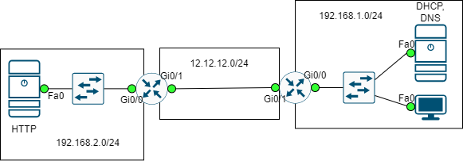

# STATIC NAT



**Yêu cầu**:

Máy ở mạng 192.168.1.0/24 có thể ping và lướt web được theo địa chỉ công khai của web server là 12.12.12.12. Server ở mạng cung cấp dịch vụ DHCP và DNS, trong đó DNS phân giải tên miền domaintest.com thành địa chỉ web 12.12.12.12.

## CẤU HÌNH

**Cấu hình OSPF**:

- Ở R1:

```
router ospf 1
network 12.12.12.0 0.0.0.255 area 0
```

- Ở R2:

```
router ospf 1
network 12.12.12.0 0.0.0.255 area 0
network 192.168.1.0 0.0.0.255 area 0
```

**Cấu hình NAT**:

- Xác định interface Inside và Outside:

```
interface gigabitEthernet 0/0
ip nat inside
interface gigabitEthernet 0/1
ip nat outside
```

- Cấu hình NAT chuyển đối địa chỉ công khai 12.12.12.12 thành địa chỉ riêng tư 192.168.2.2.

```
ip nat inside source static 192.168.2.2 12.12.12.12
```

## REFERENCE

[1] <https://www.cisco.com/c/en/us/support/docs/ip/network-address-translation-nat/13778-9.html>

[2] <https://www.cisco.com/c/en/us/td/docs/routers/ir910/software/release/1_2/configuration/guide/ir910scg/swnat.pdf>
