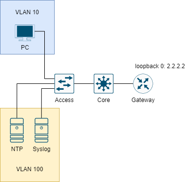

# NTP AND SYSLOG CONFIGURATION



Cấu hình Syslog để thu thập thông tin từ các thiết bị `Access`, `Core` và `Gateway`.

## CÁC BƯỚC CẤU HÌNH

Cấu hình địa chỉ IP cho các thiết bị:

|Machine|Interface|IP address|Netmask|Gateway|
|:------|:--------|:---------|:------|:------|
|NTP Server|Fa0|10.0.100.15|255.255.255.0|10.0.100.254|
|Syslog Server|Fa0|10.0.100.16|255.255.255.0|10.0.100.254|
|PC|Fa0|10.0.10.15|255.255.255.0|10.0.10.254|
|Core|VLAN 10|10.0.10.254|255.255.255.0|10.0.10.1|
|Core|VLAN 100|10.0.10.254|255.255.255.0|10.0.10.1|
|Core|gi1/0/1|10.0.1.2|255.255.255.0|#|
|Gateway|gi0/0/1|10.0.1.1|255.255.255.0|#|
|Gateway|gi0/0/1.10|10.0.10.1|255.255.255.0|#|
|Gateway|gi0/0/1.100|10.0.100.1|255.255.255.0||
|Gateway|loopback 0|2.2.2.2|255.255.255.255|#|

- Tại R1:

```
en
conf ter
interface gi0/0/1
ip address 10.0.1.1 255.255.255.0
no shut
exit
interface loopback 0
ip address 2.2.2.2 255.255.255.255
exit
```

- Tại Core:

```
en
conf ter
ip routing
interface gi1/0/1
no switchport
ip address 10.0.1.2 255.255.255.0
exit
vtp domain ZONE
vtp mode server
exit
vlan 10
vlan 100
exit
interface vlan 10
ip address 10.0.10.254 255.255.255.0
exit
interface vlan 100
ip address 10.0.100.254 255.255.255.0
exit
interface gi1/0/2
switchport mode trunk
exit
```

- Tại Access:

```
en
conf ter
vtp domain ZONE
vtp mode client
interface fa0/2
switchport mode access
switchport access vlan 10
exit
interface range fa0/23-24
switchport mode access
switchport access vlan 100
exit
interface fa0/1
switchport mode trunk
exit
```

- Tại PC:
    
    - IP address: 10.0.10.15
    - Netmask: 255.255.255.0
    - IP gateway: 10.0.10.254

- Tại NTP Server:
    
    - IP address: 10.0.100.15
    - Netmask: 255.255.255.0
    - IP gateway: 10.0.10.254

- Tại Syslog Server:
    
    - IP address: 10.0.100.16
    - Netmask: 255.255.255.0
    - IP gateway: 10.0.10.254

Cấu hình OSPF routing cho Core và Gateway:

- Tại Core:

```
router ospf 1
network 0.0.0.0 255.255.255.255 area 0
exit
```

- Tại Gateway:

```
router ospf 1
network 0.0.0.0 255.255.255.255 area 0
exit
```

Cấu hình Syslog cho Gateway và Core sau đó gửi về cho Syslog server:

- Tại Router:

```
logging host 10.0.100.16
```

- Tại Core:

```
logging host 10.0.100.16
```

Cấu hình NTP cho Gateway và Core như sau:

```
ntp server 10.0.100.15
service timestamps log datetime msec
```

## REFERENCE

[1] <https://www.cisco.com/c/en/us/td/docs/routers/nfvis/command/b-nfvis-command-ref/m-syslog-commands.pdf>
