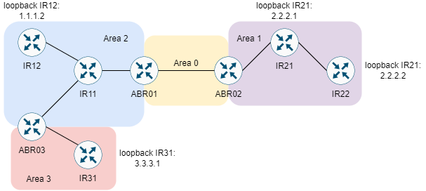

# MULTIPLE AREA OSPF CONFIGURATION



Cấu hình OSPF nhiều area như mô hình.

## BƯỚC CẤU HÌNH

**Cấu hình địa chỉ IP cho các NIC**:

|Machine|Interface|IP address|Netmask|
|:------|:--------|:---------|:------|
|ABR01|gi0/0|10.0.0.5|255.255.255.252|
|ABR01|gi0/1|10.0.0.9|255.255.255.252|
|ABR02|gi0/0|10.0.0.6|255.255.255.252|
|ABR02|gi0/1|10.0.0.21|255.255.255.252|
|IR11|gi0/1|10.0.0.10|255.255.255.252|
|IR11|gi0/0|10.0.0.13|255.255.255.252|
|IR11|gi0/2|10.0.0.17|255.255.255.252|
|IR12|gi0/0|10.0.0.14|255.255.255.252|
|IR12|loopback 0|2.2.2.2|255.255.255.252|
|IR21|gi0/1|10.0.0.22|255.255.255.252|
|IR21|gi0/0|10.0.0.25|255.255.255.252|
|IR22|loopback 0|2.2.2.2|255.255.255.255|
|IR22|gi0/0|10.0.0.26|255.255.255.252|
|ABR03|gi0/2|10.0.0.18|255.255.255.252|
|ABR03|gi0/0|10.0.0.29|255.255.255.252|
|IR31|gi0/0|10.0.0.30|255.255.255.252|
|IR31|loopback 0|3.3.3.1|255.255.255.255|

- Tại ABR01:

```
en
conf ter
interface gi0/0 
ip address 10.0.0.5 255.255.255.252
no shut
exit
interface gi0/1
ip address 10.0.0.9 255.255.255.252
no shut
```

- Tại ABR02:

```
en
conf ter
interface gi0/0
ip address 10.0.0.6 255.255.255.252
no shut
exit
interface gi0/1
ip address 10.0.0.21 255.255.255.252
no shut
```

- Tại IR11:

```
en
conf ter
interface gi0/1
ip address 10.0.0.10 255.255.255.252
no shut
exit
interface gi0/0
ip address 10.0.0.13 255.255.255.252
no shut
exit
interface gi0/2
ip address 10.0.0.17 255.255.255.252
no shut
exit
```

- Tại IR12:

```
en
conf ter
interface gi0/0
ip address 10.0.0.14 255.255.255.252
no shut
exit
interface loopback 0
ip address 2.2.2.2 255.255.255.255
no shut
exit
```

- Tại ARB03:

```
en
conf ter
interface gi0/2
ip address 10.0.0.18 255.255.255.252
no shut
exit
interface gi0/0
ip address 10.0.0.29 255.255.255.252
no shut
exit
```

- Tại IR31:

```
en
conf ter
interface gi0/0
ip address 10.0.0.30 255.255.255.252
no shut
exit
interface loopback 0
ip address 3.3.3.1 255.255.255.255
exit
```

- Tại IR21:

```
en
conf ter
interface gi0/1
ip address 10.0.0.22 255.255.255.252
exit
interface gi0/0
ip address 10.0.0.25 255.255.255.252
no shut
exit
```

- Tại IR22

```
en
conf ter
interface loopback 0
ip address 2.2.2.2 255.255.255.255
exit
interface gi0/0
ip address 10.0.0.26 255.255.255.252
no shut
exit
```

**Cấu hình OSPF multi area cho các router**:

- Tại ABR01

```
interface gi0/0
ip ospf 1 area 0
exit
interface gi0/1
ip ospf 1 area 1
exit
```

- Tại ABR02:

```
interface gi0/0
ip ospf 1 area 0
exit
interface gi0/1
ip ospf 1 area 2
```

- Tại IR11:

```
router ospf 1
network 0.0.0.0 255.255.255.255 area 1
```

- Tại IR12:

```
router ospf 1
network 0.0.0.0 255.255.255.255 area 1
exit
```

- Tại ABR03:

```
interface gi0/2
ip ospf 1 area 1
exit
interface gi0/0
ip ospf 1 area 3
exit
```

- Tại IR03:

```
router ospf 1
network 0.0.0.0 255.255.255.255 area 3
exit
```

- Tại IR21:

```
router ospf 1
network 0.0.0.0 255.255.255.255 area 2
exit
```

- Tại IR22:

```
router ospf 1
network 0.0.0.0 255.255.255.255 area 2
exit
```

**Tạo liên kết ảo giữa Area 3 và Area 0**, như đề cập ở [[1]](https://www.cisco.com/c/en/us/support/docs/ip/open-shortest-path-first-ospf/118879-configure-ospf-00.html) rằng các area cần được kết nối trực tiếp nhau bằng cách vật lý, do đó area 3 dang bị cách biệt về khoản tiếp cận vật lý này. Do đó cần cấu hình liên kết ảo (virtual link) để :

- Tại ABR01, với area là 1 và router ARB03 với router ID là 10.0.0.29:

```
router ospf 1
area 1 virtual-link 10.0.0.29
```

- Tại ABR03, với area là 1 và router ARB01 với router ID là 10.0.0.9:

```
router ospf 1
area 1 virtual-link 10.0.0.9
```

## REFERENCE

[1] <https://www.cisco.com/c/en/us/support/docs/ip/open-shortest-path-first-ospf/118879-configure-ospf-00.html>

[2] <https://www.cisco.com/c/en/us/support/docs/ip/open-shortest-path-first-ospf/7039-1.html>
