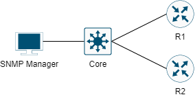

# SNMP CONFIGURATION



Cấu hình SNMP server lên các router 1, 2 và Core Switch.

## CÁC BƯỚC CẤU HÌNH

Đầu tiên, thực hiện cấu hình địa chỉ IP các thiết bị:

|Machine|Interface|IP address|Netmask|Gateway|
|:------|:--------|:---------|:------|:------|
|R1|Gi0/1|10.0.10.16|255.255.255.0|#|
|R2|Gi0/1|10.0.20.16|255.255.255.0|#|
|SNMP Manager|Fa0|10.0.100.14|255.255.255.0|10.0.100.15|
|Core|gi1/0/2|10.0.100.15|255.255.255.0|#|
|Core|gi1/0/23|10.0.10.15|255.255.255.0|#|
|Core|gi1/0/24|10.0.20.15|255.255.255.0|#|

- Tại R1:

```
en
conf ter
interface gi0/1
encapsulation dot1q 10
ip address 10.0.10.16 255.255.255.0
no shut
exit
```

- Tại R2:

```
en
conf ter
interface gi0/1
encapsulation dot1q 20
ip address 10.0.10.26 255.255.255.0
no shut
exit
```

- Tại Core:

```
en
conf ter
ip routing
interface gi1/0/2
no switchport
ip address 10.0.100.15 255.255.255.0
exit
interface gi1/0/23
no switchport
ip address 10.0.10.15 255.255.255.0
exit
interface gi1/0/24
no switchport
ip address 10.0.20.15 255.255.255.0
```

- Tại PC cấu hình:
    
    - Ip address: 10.0.100.14
    - Netmask: 255.255.255.0
    - Ip gateway: 10.0.100.15

Cấu hình định tuyến OSPF cho các router 1 và 2 và Core:

- Tại R1:

```
router ospf 1
network 0.0.0.0 255.255.255.255 area 0
exit
```

- Tại R2:

```
router ospf 1
network 0.0.0.0 255.255.255.255 area 0
exit
```

- Tại Core:

```
router ospf 1
network 0.0.0.0 255.255.255.255 area 0
exit
```

Cấu hình snmp server trên các router 1 và 2:

- Tại R1:

```
snmp-server community public ro
snmp-server community private rw
```

- Tại R2:

```
snmp-server community public ro
snmp-server community private rw
```

## REFERENCE

[1] <https://www.cisco.com/c/en/us/support/docs/ip/simple-network-management-protocol-snmp/7282-12.html>
