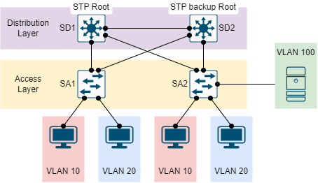

# SPANNING TREE PROTOCOL example

Cấu hình cho một switch L3 là STP root và switch L3 còn lại là STP backup root. Bên cạnh đó, cấu hình portfast cho các cổng kết nối trực tiếp với các máy trạm và server.

## CÁC BƯỚC CẤU HÌNH

### CẤU HÌNH ĐỊA CHỈ IP, VLAN

|Machine|Inerface|IP address|Netmask|Gateway|
|:------|:-------|:---------|:------|:------|
|PC1|Fa0|192.168.10.5|255.255.255.0|192.168.10.1|
|PC2|Fa0|192.168.20.5|255.255.255.0|192.168.20.1|
|PC3|Fa0|192.168.10.6|255.255.255.0|192.168.10.1|
|PC4|Fa0|192.168.20.6|255.255.255.0|192.168.20.1|
|Server|Fa0|192.168.100.5|255.255.255.0|192.168.100.1|
|SD1|VLAN 10|192.168.10.1|255.255.255.0|#|
|SD1|VLAN 20|192.168.20.1|255.255.255.0|#|
|SD1|VLAN 100|192.168.100.1|255.255.255.0|#|

Cấu hình VTP server cho SD1, VTP client cho các switch còn lại. Đặc biệt SD2 được cấu hình như một backup VTP server.

### CẤU HÌNH VTP (v3)

Tại SD1 sẽ là VTP server.

### CẤU HÌNH STP

...

### CẤU HÌNH PORTFAST

## REFERENCE

[1] <https://www.cisco.com/c/en/us/support/docs/smb/switches/cisco-small-business-300-series-managed-switches/smb5760-configure-stp-settings-on-a-switch-through-the-cli.html>

[2] <https://www.cisco.com/c/en/us/td/docs/switches/datacenter/nexus6000/sw/layer2/7x/b_6k_Layer2_Config_7x/config_vtp_v3.pdf>

[3] <https://www.cisco.com/c/en/us/support/docs/lan-switching/spanning-tree-protocol/5234-5.html>

[4] <https://www.cisco.com/c/en/us/td/docs/routers/access/3200/software/wireless/SpanningTree.html#wp1049291>
