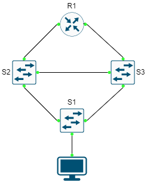

# SPANNING TREE NONROOT-NONVLAN example

## CÁC BƯỚC CẤU HÌNH

### CẤU HÌNH ĐỊA CHỈ IP

...

### CẤU HÌNH STP NON ROOT - NON VLAN

...

## REFERENCE

[1] <https://www.cisco.com/c/en/us/support/docs/lan-switching/spanning-tree-protocol/5234-5.html>

[2] <https://www.cisco.com/c/en/us/td/docs/routers/access/3200/software/wireless/SpanningTree.html#wp1049291>
