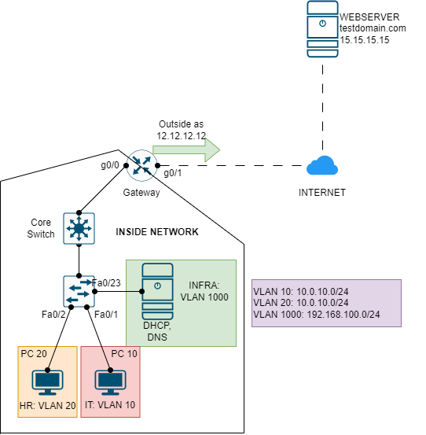

# SERVICE FROM ANOTHER VLAN



Thực hiện cấu hình mô hình mạng sau cho các máy ở mạng VLAN khác có thể tương tác các DNS, DHCP ở VLAN INFRA, cụ thể các PC có thể gửi yêu cầu DHCP và DNS đến server dù ở các VLAN khác nhau.

## CONFIGURATION STEP

### CẤU HÌNH ĐỊA CHỈ IP

|Machine|Interface|IP address|Net mask|Default Gateway|
|:------|:--------|:---------|:-------|:--------------|
|Internal Server|Fa0|192.168.100.2|255.255.255.0|#|
|PC 10|Fa0|DHCP|DHCP|DHCP|
|PC 20|Fa0|DHCP|DHCP|DHCP|
|Core Switch|VLAN 10|192.168.10.1|255.255.255.0|10.0.10.254|
|Core Switch|VLAN 20|10.0.10.1|255.255.255.0|10.0.20.254|
|Core Switch|VLAN 100|192.168.100.1|255.255.255.0|192.168.100.254|
|Gateway|g0/0.10|10.0.10.254|255.255.255.0|#|
|Gateway|g0/0.20|10.0.20.254|255.255.255.0|#|
|Gateway|g0/0.100|192.168.1.254|255.255.255.0|#|
|Gateway|g0/1|12.12.12.12|255.255.255.0|#|
|INTERNET|g0/0|12.12.12.254|255.255.255.0|#|
|INTERNET|g0/1|15.15.15.254|255.255.255.0|#|
|WEB SERVER|Fa0|15.15.15.15|255.255.255.0|15.15.15.254|

Tại router, cấu hình các subinterface cho VLAN 10 như sau:

```
interface g0/0.10
encapsulation dot1q 10
ip address 10.0.10.254 255.255.255.0
no shut
```

Các VLAN 20 và 100 cũng thực hiện tương tự.

### CẤU HÌNH SERVER

Server chỉ bật DHCP để phân phát địa chỉ IP và DNS để phân giải tên miền:

**Đối với dịch vụ DHCP**:

- VLAN 10 pool: có địa chỉ IP bắt đầu là 10.0.10.5, tối đa 5 user. Địa chỉ netmask là 255.255.255.0, default gateway IP là 10.0.10.254.
- VLAN 20 pool: có địa chỉ IP bắt đầu là 10.0.20.5, tối đa 5 user. Địa chỉ netmask là 255.255.255.0, default gateway IP là 10.0.20.254.

**Đối với dịch vụ DNS**:

- Record A chuyển đổi testdomain.com thành 15.15.15.15.

### CẤU HÌNH OSPF

Cấu hình OSPF cho Router Gateway và INTERNET có process là 1 và area là 0:

- Router Gateway quảng bá mạng 12.12.12.0/24.
- Router INTERNET quảng bá mạng 12.12.12.0/24 và 15.15.15.0/24.

### CẤU HÌNH INTERNAL NETWORK

**Cấu hình Core Switch**:

- Tạo `ZAUZOOZ` domain, kiểm tra cấu hình VTP bằng `show vtp status`:

```
en
conf ter
vtp domain ZAUZOOZ
vtm mode server
exit
```

- Tạo các mạng VLAN (10: IT, 20: HR, INFRA: 100) cho domain `ZAUZOOZ`:

```
vlan 10
name IT
exit
vlan 20
name HR
vlan 100
name INFRA
```

- Gán điạ chỉ IP cho các VLAN (VLAN 10: 10.0.10.1, VLAN 20: 10.0.20.1, VLAN 100: 192.168.100.1):

```
interface vlan 10
ip address 10.0.10.1 255.255.255.0
ip helper-address 192.168.100.2
exit
interface vlan 20
ip address 10.0.20.1 255.255.255.0
ip helper-address 192.168.100.2
exit
interface vlan 100
ip address 192.168.100.1 255.255.255.0
ip helper-address 192.168.100.2
exit
```

- Cấu hình trunk port cho cổng kết nối với L2 switch, ví dụ cổng gi1/0/24:

```
interface gi1/0/1
switchport mode trunk
interface gi1/0/24
switchport mode trunk
```

**Cấu hình STP tại Switch L2**:

- Cấu hình VTP client cho Switch L2, kiểm tra xem VTP client đã đồng bộ hay chưa bằng `show vtp status`:

```
vtp domain ZAUZOOZ
vtp mode client
exit
```

- Sau khi động bộ với VTP server, L2 Switch sẽ tự động có các VLAN từ VTP server. Thực hiện gán các access port cho các máy tương ứng:

```
interface fa0/1
switchport mode access
switchport access vlan 10
exit
interface fa0/2
switchport mode access
switchport access vlan 20
exit
interface fa0/23
switchport mode access
switchport access vlan 100
exit
```

**Cấu hình Port Address Translation (Dynamic NAT Overload) cho Router Gateway**:

- Xác định Interface Inside (xin lưu ý là các g0/0.10, g0/0.20 và g0/0.100, chứ không phải là g0/0 đâu:">>>) và Outside (g0/1):

```
en
conf ter
interface g0/1
ip nat outside
exit
interface g0/0.10
ip nat inside
interface g0/0.20
ip nat inside
interface g0/0.100
ip nat inside
exit
```

- Tạo một IP pool chỉ có địa chỉ 12.12.12.12:

```
ip nat pool ZAUZOOZ_POOL 12.12.12.12 12.12.12.12 netmask 255.255.255.0
```

- Access List cho IP cần NAT:

```
access-list 1 permit 10.0.10.0 0.0.0.255
access-list 1 permit 10.0.20.0 0.0.0.255
access-list 1 permit 192.168.100.0 0.0.0.255
```

- Cấu hình NAT:

```
ip nat inside source list 1 pool ZAUZOOZ_POOL overload
```

## REFERENCE

[1] <https://community.cisco.com/t5/networking-knowledge-base/configuring-ip-helper-address-to-issue-ip-address-from-dhcp/ta-p/4680974>
