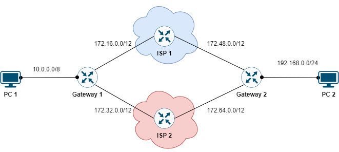

# LOAD-BALANCING USING STATIC ROUTERS



Thực hiện cấu hình mạng cân bằng tải cho các *Gateway* bằng defaute route.

## CÁC BƯỚC CẤU HÌNH

### Thực hiện cấu hình địa chỉ IP theo yêu cầu như sau

|Machine|Interface|IP address|Netmask|Gateway|
|:------|:--------|:---------|:------|:------|
|Gateway1|se0/0/0|172.16.0.6|255.240.0.0|#|
|Gateway1|se0/0/1|172.32.0.6|255.240.0.0|#|
|Gateway1|gi0/0|10.0.1.1|255.0.0.0|#|
|Gateway2|se0/0/0|172.48.0.6|255.240.0.0|#|
|Gateway2|se0/0/1|172.64.0.6|255.240.0.0|#|
|Gateway2|gi0/0|192.168.1.1|255.255.255.0||
|ISP 1|se0/2/0|172.16.1.254|255.240.0.0|#|
|ISP 1|se0/2/1|172.48.1.254|255.240.0.0|#|
|ISP 2|se0/2/0|172.32.1.254|255.240.0.0|#|
|ISP 2|se0/2/1|172.64.1.254|255.240.0.0|#|
|PC 1|Fa0|10.0.0.5|255.0.0.0|10.0.1.1|
|PC 2|Fa0|192.168.1.5|255.255.255.0|192.168.1.1|

### Cấu hình default-route cho các ISP

**Cấu hình defaut-rote route cho *ISP1***:

```
ip route 0.0.0.0 0.0.0.0 172.16.0.6
ip route 0.0.0.0 0.0.0.0 172.48.0.6
```

**Cấu hình defaut-rote route cho *ISP2***:

```
ip route 0.0.0.0 0.0.0.0 172.32.0.6
ip route 0.0.0.0 0.0.0.0 172.64.0.6
```

### Cấu hình load-balancing bằng static route

**Cấu hình defaute-route load-balancing cho *Gateway1***:

```
ip route 0.0.0.0 0.0.0.0 172.16.1.254
ip route 0.0.0.0 0.0.0.0 172.32.1.254
```

**Cấu hình defaute-route load-balancing cho *Gateway2***:

```
ip route 0.0.0.0 0.0.0.0 172.48.1.254
ip route 0.0.0.0 0.0.0.0 172.64.1.254
```


## REFERENCE
