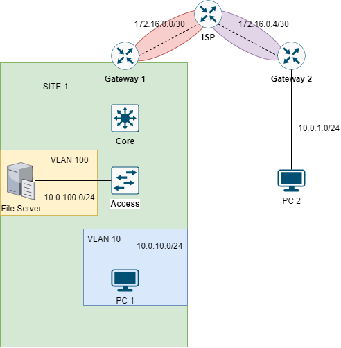

# CẤU HÌNH REMOTE ACCESS VPN



## CÁC BƯỚC CẤU HÌNH

### CẤU HÌNH CÁC KẾT NỐI

**Bảng các địa chỉ IP**:

Tại `MAIN SITE`:

|Machine|Interface|IP address|Netmask|Gateway|
|:------|:--------|:---------|:------|:------|
|Gateway 1|gi0/0|12.12.12.6|255.255.255.0|#|
|Gateway 1|gi0/1|10.0.1.1|255.255.255.0|#|
|Gateway 1|gi0/1.10|10.0.10.1|255.255.255.0|#|
|Gateway 1|gi0/1.20|10.0.20.1|255.255.255.0|#|
|Gateway 2|gi0/1.100|10.0.100.1|255.255.255.0|#|
|Core 1|VLAN 10|10.0.10.2|255.255.255.0|#|
|Core 1|VLAN 20|10.0.20.2|255.255.255.0|#|
|Core 1|VLAN 100|10.0.100.5|255.255.255.0|#|
|SERVER|Fa0|10.0.100.15|255.255.255.0|10.0.100.1|

Tại `ANOTHER SITE`:

|Machine|Interface|IP address|Netmask|Gateway|
|:------|:--------|:---------|:------|:------|
|Gateway 2|gi0/0|14.14.14.6|255.255.255.0|#|
|Gateway 2|gi0/1|10.0.10.1|255.255.255.0||

Tại `INTERNET`:

|Machine|Interface|IP address|Netmask|Gateway|
|:------|:--------|:---------|:------|:------|
|INTERNET|gi1/0/1|12.12.12.5|255.255.255.0|#|
|INTERNET|gi1/0/2|14.14.14.5|255.255.255.0|#|
|INTERNET|gi1/0/3|15.15.15.5|255.255.255.0|#|

Tại *CISCO* Server:

|Machine|Interface|IP address|Netmask|Gateway|
|:------|:--------|:---------|:------|:------|
|CISCO|Fa0|15.15.15.15|255.255.255.0|15.15.15.6|

#### CẤU HÌNH TẠI `INTERNET` và *CISCO* SERVER

**Cấu hình INTERNET**:

- Tạo các VLAN:

```
en
conf ter
interface gi1/0/1
no switchport
ip address 12.12.12.5 255.255.255.0
no shut
interface gi1/0/2
no switchport
ip address 14.14.14.5 255.255.255.0
no shut
interface gi1/0/3
no switchport
ip address 15.15.15.5 255.255.255.0
no shut
```

- Bật tính năng routing cho `INTERNET`:

```
ip routing
```

#### CẤU HÌNH TẠI `MAIN SITE`

**Cấu hình tại *Gateway 1***:

- Cấu hình địa chỉ IP:

```
en
conf ter
interface gi0/0
ip address 12.12.12.6 255.255.255.0
no shut
exit
interface gi0/1
ip address 10.0.1.1 255.255.255.0
no shut
exit
interface gi0/1.10
encapsulation dot1q 10
ip address 10.0.10.1 255.255.255.0
exit
interface gi0/1.20
encapsulation dot1q 20
ip address 10.0.20.1 255.255.255.0
exit
```

- Cấu hình default-route đi ra ngoài Internet:

```
ip 0.0.0.0 0.0.0.0 gi0/0
```

- Cấu hình PAT (Port Addresss Translation):

```
# XÁC ĐỊNH INTERFACE INSIDE VÀ OUTSIDE
interface gi0/0
ip nat outside
exit
interface gi0/1
ip nat inside
exit
interface gi0/1.10
ip nat inside
exit
interface gi0/1.20
ip nat inside
exit
interface gi0/1.100
ip nat inside

# TẠO NAT-POOL CÁC IP ĐỂ DỊCH
ip nat pool NAT_POOL 12.12.12.5 12.12.12.5 netmask 255.255.255.0

# TẠO ACCESS-LIST CÁC ĐỊA CHỈ IP CẦN DỊCH
access-list 1 permit 10.0.1.0 0.0.0.255
access-list 1 permit 10.0.10.0 0.0.0.255
access-list 1 permit 10.0.20.0 0.0.0.255
access-list 1 permit 10.0.100.0 0.0.0.255

# ÁP DỤNG NAT DỰA TEO ACCESS-LIST VÀ NAT-POOL ĐÃ TẠO
ip nat inside source list 1 pool NAT_POOL overload
```

- Lưu cấu hình:

```
wr
copy running-config startup-config
```

**Cấu hình *Core 1***:

- Tạo các VLAN:

```
en
conf ter
vlan 10
vlan 20
vlan 100
```

- Cấu hình IP cho các VLAN:

```
interface vlan 10
ip address 10.0.10.2 255.255.255.0
ip helper-address 10.0.100.15
exit
interface vlan 20
ip address 10.0.20.2 255.255.255.0
ip helper-address 10.0.100.15
exit
interface vlan 100
ip address 10.0.100.2 255.255.255.0
ip helper-address 10.0.100.15
exit
```

- Bật tính năng định tuyến:

```
ip routing
```

- Cấu hình cổng trunk cho các cổng kết nối với *Gateway 1* và *Access 1*:

```
interface range gi1/0/1-2
switchport mode trunk
```

- Lưu cấu hình:

```
wr
copy running-config startup-config
```

**Cấu hình *Access 1***:

- Tạo các VLAN:

```
en
conf ter
vlan 10
vlan 20
vlan 100
```

- Gán các VLAN cho các access port tương ứng:

```
interface fa0/22
switchport mode access
switchport access vlan 100
exit
interface fa0/23
switchoport mode access
switchport access vlan 10
interface fa0/24
switchport mode access
switchport access vlan 20
```

#### CẤU HÌNH TẠI `ANOTHER SITE`

**Cấu hình *Gateway 2***:

- Cấu hình địa chỉ IP:

```
en
conf ter
interface gi0/0
ip address 14.14.14.6 255.255.255.0
no shut
exit
interface gi0/1
ip address 10.0.10.1 255.255.255.0
exit
```

- Cấu hình default route:

```
ip route 0.0.0.0 0.0.0.0 gi0/0
```

- Cấu hình PAT để các máy giao tiếp ra Internet với địa chỉ 14.14.14.5:

```
# XÁC ĐỊNH INTERFACE INSIDE VÀ OUTSIDE
interface gi0/0
ip nat outside
exit
interface gi0/1
ip nat inside

# TẠO NAT-POOL CÁC ĐỊA CHỈ IP CÓ THỂ DỊCH
ip nat pool 14.14.14.6 14.14.14.6 netmask 255.255.255.0

# TẠO ACCESS-LIST CÁC ĐỊA CHỈ IP CẦN NAT
access-list 1 permit 10.0.10.1 0.0.0.255

# ÁP DỤNG NAT DỰA THEO NAT-POOL VÀ ACCESS-LIST ĐÃ CÓ
ip nat inside source list 1 pool NAT_POOL overload
```

### CẤU HÌNH VPN REMOTE ACCESS

...

## REFERENCE

[1] <https://www.cisco.com/c/en/us/td/docs/security/firepower/623/fdm/fptd-fdm-config-guide-623/fptd-fdm-ravpn.html>

[2] <https://www.firewall.cx/cisco/cisco-routers/cisco-router-vpn-client.html>

[3] <https://www.cisco.com/c/en/us/support/docs/routers/1700-series-modular-access-routers/71462-rtr-l2l-ipsec-split.html>
