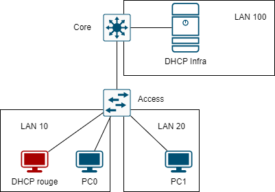

# DHCP Snooping



Xây dựng mô hình mạng như hình trên:

- DHCP server có địa chỉ IP là `10.0.100.15/24`.
- Core switch cấu hình VLAN 10 có địa chỉ IP là `10.0.10.254/24`, cấu hình VLAN 20 có địa chỉ là `10.0.20.254/24`, cấu hình địa chỉ IP cho VLAN 100 là `10.0.100.254/24`.
- Cấu hình access port trunkport hợp lý cho các thiết bị Core và Access.
- Các máy trong VLAN 10 có địa chỉ được cấp phát trong khoảng `10.0.10.1-10.0.10.15`, địa chỉ IP gateway là `10.0.10.253`.
- Các máy trong VLAN 20 có địa chỉ được cấp phát trong khoảng `10.0.20.1-10.0.20.15`, địa chỉ IP gateway là `10.0.10.253`.

Giả sử máy PC0 bị nhiễm mã độc để thực hiện là một DHCP rouge trong mạng LAN 10, cấu hình cố định địa chỉ IP DHCP rouge là 10.0.10.253, cung cấp các thông tin:

- Địa chỉ IP, pool là `10.0.10.16 - 10.0.10.30`
- Địa chỉ IP gateway là `10.0.10.253`
- Địa chỉ IP DNS là `10.0.10.253`.

## CẤU HÌNH

Để cấu hình DHCP rouge, tại Access switch thực hiện các lệnh sau:

```
en
conf ter
ip dhcp snooping # enable dhcp snooping
ip dhcp snooping vlan 1 # áp dụng dhcp trên vlan 1
ip dhcp snooping vlan 10 # áp dụng dhcp trên vlan 10
ip dhcp snooping vlan 20 # áp dụng dhcp trên vlan 20
interface fa0/1
 ip dhcp snooping trust # interface mà ta tin tưởng
 end
```

## REFERENCE

[1] <https://www.cisco.com/c/en/us/td/docs/dcn/nx-os/nexus3548/103x/configuration/security/cisco-nexus-3548-nx-os-security-configuration-guide-103x/m-configuring-dhcp-snooping.pdf>
