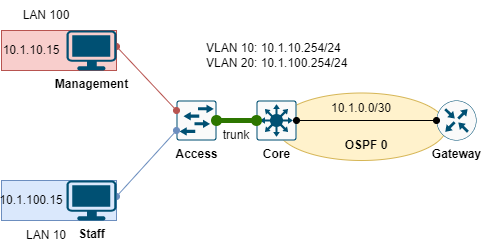

# SECURE REMOTE CONNECTION TO CISCO ROUTER



**Yêu cầu**:

- Đảm bảo các địa chỉ IP có thể ping được với nhau.
- Remote access sử dụng SSH.
- Chỉ có máy Management có thể kết nối SSH đến thiết bị router.
- Cấu hình username/password cho login vào User mode của Router và password cho vào Privilege mode.

## CÁC BƯỚC CẤU HÌNH

### Cấu hình kết nối

Cấu hình địa chỉ IP cho các thiết bị:

|Machine|Interface|IP address|Netmask|IP Gateway|
|:------|:--------|:---------|:------|:---------|
|Gateway|gig0/0/0|10.1.0.1|255.255.255.252|#|
|Core|gig1/0/1|10.1.0.2|255.255.255.252|#|
|Core|VLAN 10|10.1.10.254|255.255.255.0|#|
|Core|VLAN 100|10.1.100.254|255.255.255.0|#|
|Management|Fa0|10.1.10.15|255.255.255.0|10.1.10.254|
|Staff|Fa0|10.1.100.15|255.255.255.0|10.1.100.254|

Cấu hình OSPF cho Router:

```
router ospf 1
 network 0.0.0.0 255.255.255.255 area 0
```

Cấu hình OSPF cho Core switch:

```
router ospf 1
 network 0.0.0.0 255.255.255.255 area 0
```

Cấu hình trunk port cho Core switch:

```
interface gi1/0/2
 switchport mode trunk
```

Cấu hình trunk port và access port cho Access switch:

```
interface fa0/2
 switchport mode trunk
 exit
interface fa0/23
 switchport mode access
 switchport access vlan 100
 exit
interface fa0/24
 switchport mode access
 switcport access vlan 10
 exit
```

### Cấu hình bảo mật

Cấu hình login vào User mode có xác thực username và password:

```
username nntai password nntpasswd
line vty 0 4
 login local
```

Cấu hình password để xác thực trức khi vào Privilege mode:

```
enable secret cisco
```

## REFERENCE

[1] <https://community.cisco.com/t5/other-network-architecture-subjects/how-to-set-username-and-password-at-line-vty-0-4/td-p/639154>

[2] <https://www.cisco.com/c/en/us/support/docs/security-vpn/secure-shell-ssh/4145-ssh.html>
