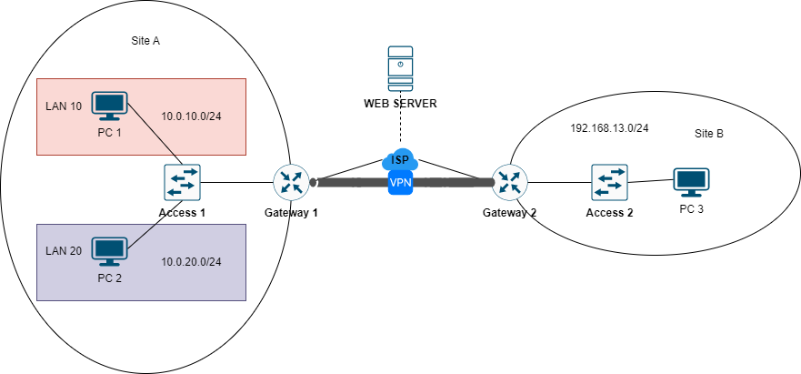

# INTRANET SITE-TO-SITE VPN CONFIG



Thực hiện cấu hình sao cho hai mạng ở site A và B kết nối VPN và có thể giao tiếp với nhau.

## CÁC BƯỚC CẤU HÌNH

**Địa chỉ IP các máy**:

|Machine|Interface|IP address|Netmask|Default-Gateway|
|:------|:--------|:---------|:------|:--------------|
|Gateway 1|Fa0/0|12.12.12.6|255.255.255.0|#|
|Gateway 1|Fa0/1|10.0.1.1|255.255.255.0|#|
|Gateway 1|Fa0/1.10|10.0.10.1|255.255.255.0|#|
|Gateway 1|Fa0/1.20|10.0.20.1|255.255.255.0|#|
|Gateway 2|Fa0/0|14.14.14.6|255.255.255.0|#|
|Gateway 2|Fa0/1|192.168.13.1|255.255.255.0|#|
|ISP|gi0/0|12.12.12.5|255.255.255.0|#|
|ISP|gi0/1|14.14.14.5|255.255.255.0|#|
|ISP|gi0/2|15.15.15.5|255.255.255.0|#|

## CẤU HÌNH KẾT NỐI

**Tại *Gateway 1***:

- Cấu hình địa chỉ IP:

```
en
conf ter
interface fa0/0
ip address 12.12.12.6 255.255.255.0
no shut
exit
interface fa0/1
ip address 10.0.10.1 255.255.255.0
exit
interface fa0/1.10
encapsulation dot1q 10
ip address 10.0.10.1 255.255.255.0
exit
interface fa0/1.20
encapsulation dot1q 20
ip addrfess 10.0.20.1 255.255.255.0
exit
```

- Cài đặt default-route:

```
ip address 0.0.0.0 0.0.0.0 fa0/0
```

**Tại *Access 1***:

- Cấu hình trunk:

```
inteface fa0/1
switchport mode trunk
exit
```

- Gán VLAN cho các cổng access:

```
interface fa0/23
switchport mode access
switchport access vlan 20
exit
interface fa0/24
switchport mode access
switchport access vlan 10
exit
```

**Tại *Gateway 2***:

- Cấu hình địa chỉ IP:

```
en
conf ter
ip address 14.14.14.6 255.255.255.0
no shut
exit
interface fa0/1
ip address 192.168.13.1 255.255.255.0
no shut
exit
```

- Cài đặt defaut-routing:

```
ip route 0.0.0.0 0.0.0.0 fa0/0
```

**Tại ISP**:

- Cấu hình địa chỉ IP:

```
en
conf ter
interface gi0/0
ip address 12.12.12.5 255.255.255.0
no shut
exit
interface gi0/1
ip address 14.14.14.5 255.255.255.0
no shut
interface gi0/2
ip address 15.15.15.5 255.255.255.0
no shut
```

- Cấu hình static route:

```
ip route 10.0.10.0 0.0.0.255 12.12.12.6
ip route 10.0.20.0 0.0.0.255 12.12.12.6
ip route 192.168.13.0 0.0.0.255 12.12.12.6
```

## CẤU HÌNH VPN

**Tại Gateway 1**:

- Tạo một ISAKMP policy cho Phase 1 negotiation của L2L tunnel với sequence number là 10, thuật toán mã hóa là AES, thuật toán băm là SHA 256, phương thức xác thực là pre-share [[5]](https://csrc.nist.gov/glossary/term/pre_shared_key) và Diffie-Hellman thuộc nhóm 1:

```
crypto isakmp policy 10
encryption aes
hash sha
authentication pre-share
group 1
```

- Preshare key là "vpnuser" sẽ được sử dụng với interface thiết lập VPN với địa chỉ là 14.14.14.6 (địa chỉ công khai `ANOTHER SITE`):

```
crypto isakmp key vpnuser address 14.14.14.6
```

- Tạo Phase 2 policy cho IPSec negotiation với transform-set là "MY_SET", ESP transform sử dụng mật mã AES và xác thực bằng SHA256:

```
crypto ipsec transform-set MY_SET esp-aes esp-sha-hmac
```

- Tạo access-list (Extend ACL) cho luồng mạng cần được mã hóa (cụ thể là từ các mạng 10.0.10.0/24, 10.0.20.0/24 và 10.0.100.0/24 đến 14.14.14.6):

```
access-list 100 permit ip 10.0.10.0 0.0.0.255 192.168.13.0 0.0.0.255
access-list 100 permit ip 10.0.20.0 0.0.0.255 192.168.13.0 0.0.0.255
```

- Tạo một Crypto Map có tên là "MY_MAP" với sequence number là 10, và chế độ cấu hình ipsec-isakmp:

```
crypto map MY_MAP 10 ipsec-isakmp
set peer 14.14.14.6 # địa chỉ IP của bên đầu kia của kết nối VPN
set transform-set MY_SET # transform-set đã tạo
match address 100 # access-list đã tạo
```

- Cấu hình interface đối diện với INTERNET áp dụng Crypto Map đã thiết lập là "MY_MAP" cho IPSec VPN:

```
interface fa0/0
crypto map MY_MAP
```

**Taị Gateway 2**:

- Tạo ISAKMP policy cho Phase 1 negotiation cho L2L tunnel với sequence number là 10, thuật toán mã hóa aes, hàm băm là sha256, phương thức xác thực là pre-share và Diffie-Helman group là 1:

```
crypto isakmp policy 10
encryption aes
hash sha
authentication pre-share
group 1
```

- Preshare key là "vpnuser" sẽ được sử dụng với interface thiết lập VPN với địa chỉ là 12.12.12.6 (địa chỉ công khai `ANOTHER SITE`):

```
crypto isakmp key vpnuser address 12.12.12.6
```

- Tạo Phase 2 policy cho IPSec negotiation với transform-set là MY_SET ESP transform sử dụng mật mã AES và xác thực bằng SHA 256:

```
crypto ipsec transform-set MY_SET esp-aes esp-sha-hmac
```

- Tạo access-list (Extend ACL) cho luồng mạng cần được mã hóa (cụ thể là từ mạng 192.168.10.0/24 đến 14.14.14.0/24)

```
access-list 100 permit ip 192.168.13.0 0.0.0.255 10.0.10.0 0.0.0.255
access-list 100 permit ip 192.168.13.0 0.0.0.255 10.0.0.0 0.0.0.255
```

- Tạo một Crypto Map có tên là "MY_MAP" với sequence number là 10, và chế độ cấu hình ipsec-isakmp:

```
crypto map MY_MAP 10 ipsec-isakmp
set peer 12.12.12.6
set transform-set MY_SET
match address 100
```

- Cấu hình interface đối diện với INTERNET áp dụng Crypto Map đã thiết lập là "MY_MAP" cho IPSec VPN:

```
interface fa0/0
crypto map MY_MAP
```

## REFERENCE

[1] <https://support.huawei.com/enterprise/en/doc/EDOC1100034238/f2298f86/using-ipsec-vpn-to-implement-secure-interconnection-between-lans>

[2] <https://www.cisco.com/c/en/us/support/docs/routers/1700-series-modular-access-routers/71462-rtr-l2l-ipsec-split.html>

[3] <https://www.watchguard.com/help/docs/help-center/en-US/Content/en-US/Fireware/mvpn/general/ipsec_vpn_negotiations_c.html>

[4] <https://www.cisco.com/c/en/us/support/docs/security-vpn/ipsec-architecture-implementation/118048-technote-ipsec-00.html>

[5] <https://csrc.nist.gov/glossary/term/pre_shared_key>

[6] <https://www.firewall.cx/cisco/cisco-routers/cisco-router-site-to-site-ipsec-vpn.html>
