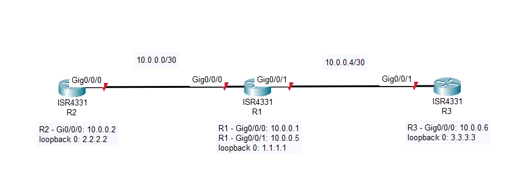
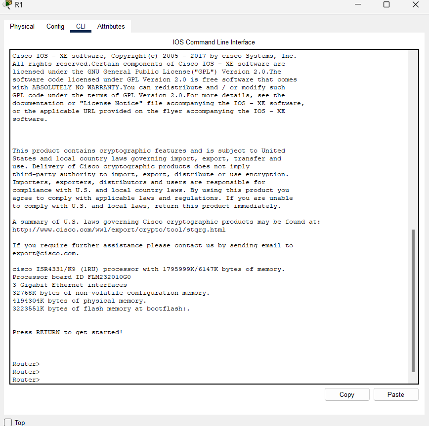
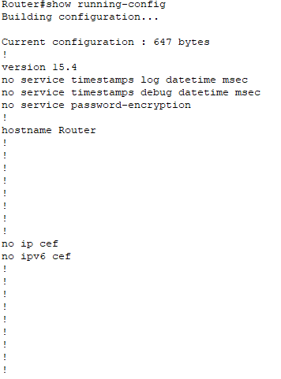
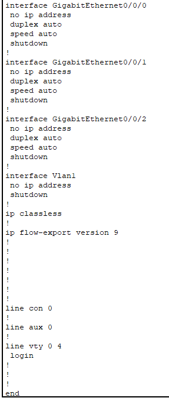
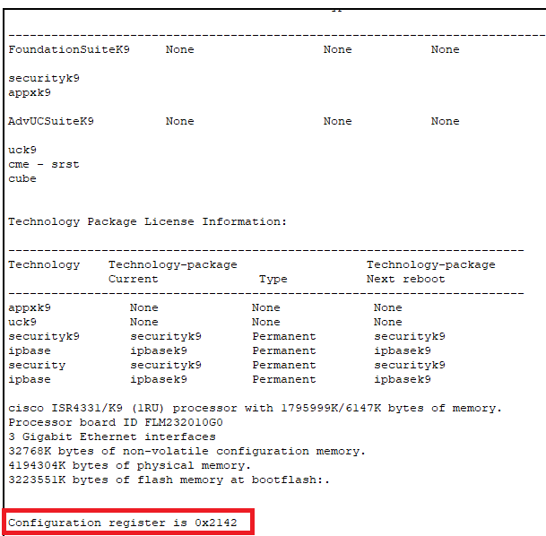

# 68: TROUBLESHOOTINGS THE NETWORK DOWN - CONFIGURATION REGISTER

## LAB SETTUP



Đầu tiên thực hiện settup mô hình mạng như trên với các địa chỉ IP tương ứng với Interface như yêu cầu. Hoàn tất cấu hình đảm bảo các Interface có thể ping cho nhau. Dùng `wr` để lưu cấu hình.

Cấu hỉnh configuration regiter tại router R1 là 0x2142:

```
configure-register 0x2142
```

Cấu hỉnh configuration regiter tại router R2 là 0x2100:

```
configure-register 0x2101
```

Copy cấu hình hiện tại vào bộ nhớ flash

```
copy running-config flash:
 live-config.cfg    
write erase # erase NVRAM
```

Sau khi hoàn thành thiết lập lab, cần Power Cycle toàn bộ thiết bị mạng.

**Yêu cầu**: phục hồi lại các cấu hình của Router mà không phải cấu hình lại từ đầu để các Interface có thể ping với nhau.

## TROUBLESHOOTING STEP

Tại Router 1, ta có thể thấy router được boost lên không gặp lỗi:



Ta tiến váo Privilege mode và kiểm tra running config bằng `show running-config`, ta có thể thấy rằng cấu hình hiện tại sử dụng giống như cấu hình mặc định của thiết bị:





Ta kiểm tả configuration register của thiết bị bằng `show version`, có thể thấy rằng configuration register là 0x2102



## REFERENCE

[1] <https://www.cisco.com/c/en/us/support/docs/routers/10000-series-routers/50421-config-register-use.html>
