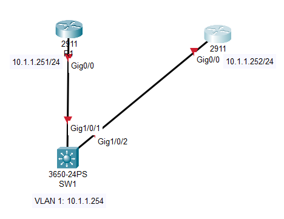
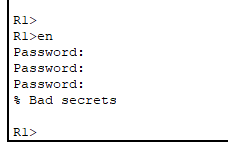
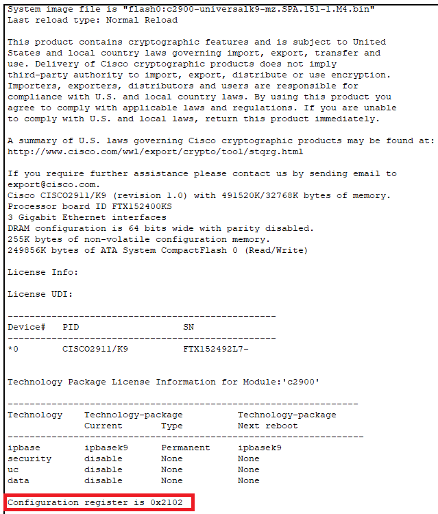
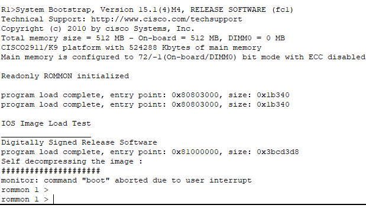
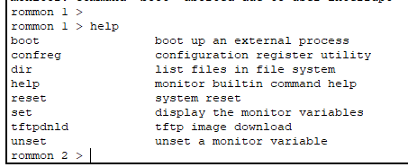
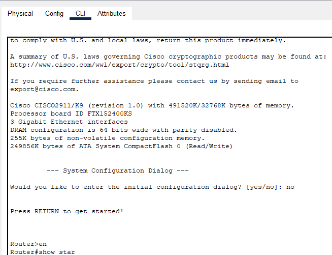
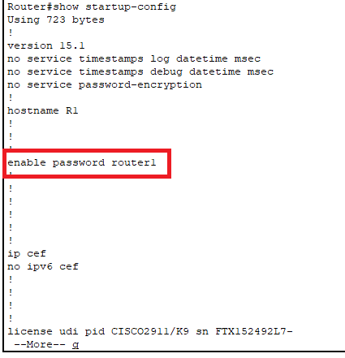
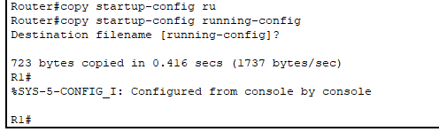
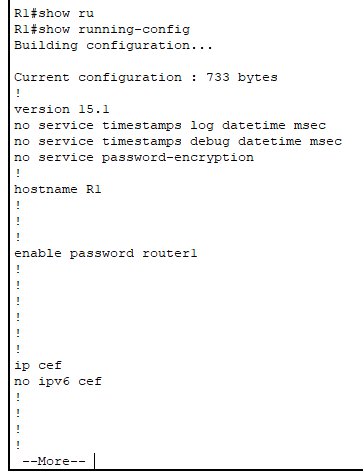
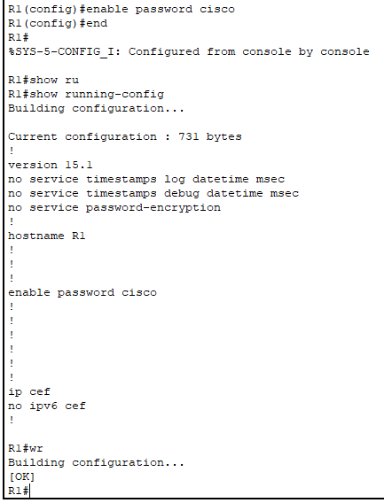

# 69: PASSWORD RECOVERY

## LAB SETUP

Thiết kế mô hình mạng như sau:



Tại R1:

```
en
conf ter
hostname R1
interface gig0/0
 ip address 10.1.1.251 255.255.255.0
 no shut
enable password router1
end
wr # Lưu cấu hình vào startup-config.
```

Tại R2:

```
en
conf ter
hostname R2
interface gig0/0
 ip address 10.1.1.252 255.255.255.0
 no shut
 exit
enable secret router2
end
wr # Lưu cấu hình vào startup-config.
```

Tại SW1:

```
en
conf ter
hostname SW1
interface vlan 1
 ip address 10.1.1.254 255.255.255.0
 no shut
 exit
enable secret switch1
end
wr # Lưu cấu hình vào startup-config.
```

Sau đó power cycle toàn bộ thiết bị mạng và tưởng tượng mình không nhớ password nào. Cấu hình password ở trên có thể nhập các ký tự ngẫu nhiên cũng được.

Nhìn chung chúng ta sẽ nhiệm vụ là tìm kiếm password cũ đổi password của thiết bị trên thành `cisco` và không ảnh hưởng đến các cấu hình còn lại.

## LAB RESOLVE

### Tại Router R1 và R2

Thử truy cập vào Privilege bằng `en`, tuy nhiên do chúng ta không biết password của thiết bị



Ta kiểm tra cách boot của thiết bị Cisco bằng lệnh `show version`:



Ta có thể thấy rằng thiết bị được boot với configuraiton register là 0x2102 [[3]](https://www.cisco.com/c/en/us/support/docs/routers/10000-series-routers/50421-config-register-use.html) tức là Router sẽ tìm tệp ISO image ở bộ nhớ flash lên bộ nhớ RAM và tải startup-config để chạy cấu hình. Vì vậy ta cần thay đổi điều này. [[3]](https://www.cisco.com/c/en/us/support/docs/routers/10000-series-routers/50421-config-register-use.html) cũng tiết cho biết rằng configuration register `0x2142` được sử dụng để Password Recovery. Thực hiện cấu hình configuration register thành `0x2142` và trả reboot thiết bị. Đầu tiên thực hiện tắt nguồn thiết bị và bật lại, sau đó thực hiện nhấn tổ hợp Control+C để ngắt quá trình boot và tiến vào ROM MON mode:



Dùng `help` để xem ở ROM MON hỗ trợ những lệnh nào, ta lưu ý lệnh `confreg` liên quan đến cấu hình configuration register và lệnh `reset` để thực hiện reboot:



Thực hiện chỉnh configuration register về `0x2142` và reboot lại Router:

```
confreg 0x2141
reset
```



Sau khi boot trở lại và dùng lệnh `en` để từ User mode sang Privilege mode mà không cần nhập password, là do ta đã bỏ qua nội dung ở NVRAM (startup-configuration) và sử dụng configuration mặc định để chép vào running-config. Dùng `show startup-config` để hiện ra startup-config của Router R1:



Như ta rõ ràng thấy được password được cấu hình cho thiết bị là `router1`. Tiếp theo, ta cần copy startup-config vào running-config (Lưu ý đang ở Privilege mode).

```
copy startup-config running-config
```



Ta đang ở trong Privilege mode bằng startup-config mà không cần password, xem running-config sau khi dùng lệnh trên.



Ta thấy ngay password `router1` vẫn còn đó. Tiếp theo ta cần thay đổi mật khẩu thành `cisco`. Cuối cùng, lưu lại cấu hình hiện tại với mật khẩu mới (và không ảnh hưởng gì với các cấu hình trước đó):

```
conf ter # Từ Privilege mode vào Configuration mode
enable password cisco
end
wr
```



Cuối cùng cấu hình configuration register trở lại `0x2102` và reboot lại Router R1:

```
conf ter
configure-register 0x2102
end
reload
```

Khởi động trở lại và đăng nhập vào Privilege mode bằng mật khẩu là `cisco`. Ta đã hoàn thành ở R1:

```

```

Router R2 thực hiện tương tự như R1.

### Tại Switch SW1

...

## REFERENCE

[1] <https://www.cisco.com/c/en/us/support/docs/routers/2800-series-integrated-services-routers/112033-c2900-password-recovery-00.html>

[2] <https://www.cisco.com/c/en/us/support/docs/routers/10000-series-routers/50421-config-register-use.html>

[3] <https://www.cisco.com/c/en/us/support/docs/routers/10000-series-routers/50421-config-register-use.html>
