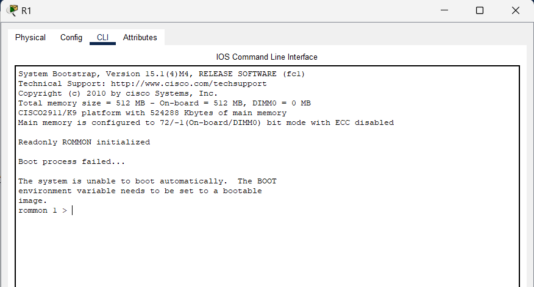

# 70: RESTORE CISCO IOS IMAGE

## LAB SETTUP

Đẩu tiên, thiết lập mô hình mạng như bên dưới.


Tại Router R1:

- Sử dụng `show version` để kiểm tra cách configuration register:


- Như đã thấy configuration register được cài đặt là `0x2102` - tức là OS được lấy từ flash tải lên RAM. Tiếp theo ta sử dụng lệnh `show flash` để kiểm tra OS:


- Ta có thể thây rằng OS image được sử dụng là `c2900-universalk9-mz.SPA.151-4.M4.bin`.

Kiểm tra trên TFTP server, ta thấy rằng không có tệp `c2900-universalk9-mz.SPA.151-4.M4.bin` nhưng có `c2900-universalk9-mz.SPA.155-3.M4a.bin`:


Cấu hình R1:

```
en
conf ter
interface gig0/0
 ip address 10.1.1.1 255.255.255.0
 no shut
 end
```

Cấu hình SW1:

```
en
conf ter
interface vlan 1
 ip address 10.1.1.2 255.255.255.0
 no shut
 end
```

Cấu hình TFTP server với các tham số như sau:

- IP address 10.1.1.15
- Netmask: 255.255.255.0
- IP gateway: 10.1.1.1

Tại router R1, thực hiện backup tệp cisco image lên TFTP server với phiên bản hiện tại có tên là `c2900-universalk9-mz.SPA.151-4.M4.bin`:

```
copy flash: tftp:
 c2900-universalk9-mz.SPA.151-4.M4.bin # source file name
 10.1.1.15                             # IP of destination Server
 c2900-universalk9-mz.SPA.151-4.M4.bin # destination file name
```


Kiểm tra lại TFTP server, ta có thể thấy tệp `c2900-universalk9-mz.SPA.151-4.M4.bin` đã tồn tại trên TFTP server.


Sau đó ta xóa tệp `c2900-universalk9-mz.SPA.151-4.M4.bin` của R1 bằng `delete flash:c2900-universalk9-mz.SPA.151-4.M4.bin` và thực hiện tắt nguồn rồi mở nguồn lại:


Dễ dàng thấy được rằng hệ thống không tìm được tệp iso nào cho hệ thông nên việc boot đã failed và router thực hiện boot vào ROM monitor mode.

## RESTORE CISCO IOS IMAGE

Đầu tiên ta thấy rằng Router 1 được chạy vào ROM MON mode.



Ta có thể thay đổi configuration register thành `0x2102` để Router boot sử dụng ISO trong flash:

```
confreg ox2102
reset
```


Tuy nhiên, Router vẫn boot vào ROM MON và thông báo là `Boot process failed...`. Thực hiện dùng `dir flash:` để kiểm tra xem ở flash có vấn đề gì không. Ta phát hiện ra rằng không hề có tệp iso nào trong flash.


Như vậy ta cần thực hiện tải tệp ISO về Router. Ta có lệnh `tftpdnld` có thể thực hiện tác vụ này.


Dựa vào thông tin mà lệnh cung cấp, ta cần thực hiện cài đặt một số tham số sau:

```
IP_ADDRESS=10.1.1.1 # địa chỉ IP mà router sẽ dùng
IP_SUBNET_MASK=255.255.255.0 # netmask mà router sẽ dùng
DEFAULT_GATEWAY=10.1.1.2 # địa chỉ IP gateway sẽ sử dụng
TFTP_SERVER=10.1.1.15 # địa chỉ IP server sẽ sử dụng
TFTP_FILE=c2900-universalk9-mz.SPA.155-3.M4a.bin # tên tệp ISO muốn tải
```

Trước khi tải,cho interface kết nối với interface gig0/0 của Router ở SW1 được cấu hình portfast:

```
interface gi1/0/2
 spanning-tree portfast
 end
```

Sau đó dùng lệnh `tftpdnld` để thực hiện tải và chọn option là `y` để bắt dầu tải. Sau khi tải xong, thực hiện dùng `dir flash:` để kiểm tra:


Như ta thấy bây giờ trong flash của Router đã có tệp iso, thực hiện lệnh `reset` để khởi động lại Router:


Như vậy Router đã được khởi động bằng ISO image được backup từ server.

## REFERENCE

[1] <https://www.cisco.com/c/en/us/td/docs/routers/access/1900/software/configuration/guide/Software_Configuration/upgrade.html>
