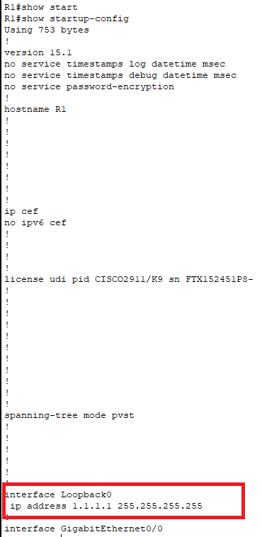

# 71: BACKUP AND RESTORE CONFIGURATION AND OPERATION SYSTEMS

## LAB SETUP

Phần này là bước chuẩn bị lab cho phần xử lý.

Đầu tiên thiết kế mô hình mạng như sau:


Các bước cấu hình để hoàn thiện Lab:

- Tại R1:

```
en
conf ter
interface gi0/0
 ip address 10.1.1.1 255.255.255.0
 no shut
end
copy running-config startup-config
```

- Tại SW1:

```
en
conf ter
interface vlan 1
 ip address 10.1.1.2 255.255.255.0
 no shut
end
copy running-config startup-config
```

- Tại TFTP cấu hình các tham số sau:
    
    - Địa chỉ IP: 10.1.1.15
    - Netmask: 255.255.255.0
    - IP gateway: 10.1.1.1

## TROUBLESHOOTING STEPS

Đầu tiên, đảm bảo Router có thể ping được đến server và ngược lại.

Để thực hiện backup một start-up config lên TFTP server có địa chỉ `10.1.1.15` và tên tệp là `startup-config-v1`:

```
copy startup-config tftp:
 10.1.1.15
 startup-config-v1
```

- Tại R1:


- Tại Server, ta có thể thấy được:


### NỘI DUNG CHÉP VÀO STARTUP-CONFIG LÀ BẰNG CÁCH OVERWRITE

**Thí nghiệm 1:**

- Đầu tiên ta sẽ thêm một loopback interface 0 có địa chỉ là `1.1.1.1` và lưu running-config này tại TFTP Server và đặt tên là `startup-config-v2`:

```
interface loopback 0
 ip address 1.1.1.1 255.255.255.255
 end
copy running-config tftp:
 10.1.1.15
 startup-config-v2
```

- Lưu ý sau bước này, startup-config chưa hề có cấu hình loopback0, cấu hình loopback chỉ có trên running-config. Trước khi copy cấu hình `startup-config-v2` vào startup-config của Router, kiểm tra cấu hình start-up config bằng lệnh `show startup-config` như đã thấy không hề có cấu hình loopback 0:


- Thực hiện copy cấu hình từ tệp `startup-config-v2` ở TFTP Server (mà có cấu hình loopback 0) vào startup-config của Router:

```
copy tftp: startup-config
 10.1.1.15
 startup-config-v2

```

- Dùng `show startup-config` lần nữa, ta có thể dễ dàng thấy được cấu hình loopback đã được thêm vào:



**Thí nghiệm 2**: 

- Tiếp nối thí nghiệm 1, ta thực hiện copy cấu hình từ tệp `startup-config-v1` (cấu hình không có loopback 0) từ TFTP server vào startup-config của Router. Sau đó dùng `show startup-config`:

```
copy tftp: startup-config
 10.1.1.15
 startup-config-v1
```


- Như đã thấy, cấu hình startup-config hiện tại không còn loopback interface nữa, bởi startup-config hoàn toàn bị ghi đè lên bởi nội dung từ `startup-config-v1`. Dựa vào kế quả từ thí nghiệm 1 và 2, ta có thể kết luận rằng việc ghi nội dung cấu hình vào startup-config của Cisco router là bằng phương pháp **overwrite**.

### NỘI DUNG CHÉP VÀO RUNNING-CONFIG LÀ BẰNG CÁCH MERGE

**Thí nghiệm 3**:

- Tại Router, thực hiện đổi loopback 0 có địa chỉ IP là `2.2.2.2`. Sau đó lưu cấu hình running-config hiện tại lên TFTP server với tên là `startup-config-v3`:

```
interface loopback 0
 no ip address 1.1.1.1 255.255.255.255
 ip address 2.2.2.2 255.255.255.255
 end
copy running-config tftp:
 10.1.1.15
 startup-config-v3
```

- Tiếp theo thực hiện copy cấu hình running-config hiện tại bằng tệp `startup-config-v1` (không có cấu hình loopback):

```
copy tftp: running-config
 10.1.1.15
 startup-config-v1
```

- Thực hiện kiểm tra thì ta phát hiện ra rằng running-config không hề mất đi loopback 0 `2.2.2.2` :


**Thí nghiệm 4**: Trong khi đó nếu ta thực hiện copy cấu hình running-config hiện tại bằng tệp `startup-config-v2` (có loopback 0 interface địa chỉ là `1.1.1.1`):

```
copy tftp: running-config
 10.1.1.15
 startup-config-v2
```

- Kết quả cho thấy rằng loopback 0 đã bị thay đổi từ `2.2.2.2` thành `1.1.1.1`:


**Thí nghiệm 5**:

- Thêm một interface loopback 3 có địa chỉ là `3.3.3.3`, sau đó dùng `show running-config` để kiểm tra:

```
interface loopback 3
 ip address 3.3.3.3 255.255.255.255
```


- Như đã thấy, các loopback interface hiện tại có địa chỉ IP lần lượt là `1.1.1.1` tại loopback 0 và `3.3.3.3` ở loopback 3. Tiếp theo ta thực hiện copy cấu hình `startup-config-v3` (chứa loopback 0 là `2.2.2.2.2`, không có loopback 3) vào running-config hiện tại và dùng `show running-config` để kiểm tra:

```
copy tftp: running-config
 10.1.1.15
 startup-config-v3
```


- So với kết quả ở hình trên, ta có thể thấy rằng loopback 0 đã được thay đổi từ `1.1.1.1` thành `2.2.2.2`, tuy nhiên loopback 3 không hề bị mất đi.

Dựa vào thí nghiệm 4, 5 và 6 ta có thể kết luận rằng nội dung của running-config sẽ được merge với cấu hình khác thay vì là overwrite như cách hoạt động của startup-config. Merge thực hiện ghi đè lên phần cấu hình nếu xảy ra conflict.


## REFERENCE

[1] <https://www.cisco.com/c/en/us/support/docs/ios-nx-os-software/ios-software-releases-122-mainline/46741-backup-config.html>