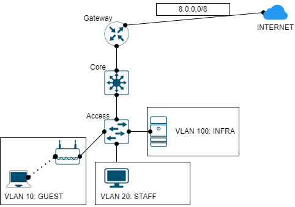

# CẤU HÌNH WIRELESS TRONG MẠNG DOANH NGHIỆP NHỎ



Thực hiện cấu hình mô hình mạng như trên:

- Các địa chỉ IP được cấp phát động cho vùng mạng VLAN STAFF và GUEST, Server thực hiện cấp phát động ở vùng mạng VLAN INFRA.
- Các máy trong vùng mạng có thể ping đến Internet.
- VLAN GUEST không được phép ping đến VLAN INFRA, chỉ thực hiện được DHCP và DNS.

## CÁC BƯỚC CẤU HÌNH

**CẤU HÌNH ĐỊA CHỈ IP**:

|Machine|Interface|IP address|Netmask|Gateway|
|:------|:--------|:---------|:------|:------|
|INTERNET|Gi0/0|8.8.8.8|255.0.0.0|#|
|Gateway|Gi0/0|8.8.8.1|255.0.0.0.0|#|
|Gateway|Gi0/1.1|10.0.1.1|255.255.255.0|#|
|Gateway|Gi0/1.10|10.0.10.1|255.255.255.0|#|
|Gateway|Gi0/1.20|10.0.20.1|255.255.255.0|#|
|Gateway|Gi0/1.100|10.0.100.1|255.255.255.0|#|
|DHCP Server|Fa0/1|10.0.100.5|255.255.255.0|10.0.100.1|
|Core|VLAN 1|10.0.1.2|255.255.255.0|#|
|Core|VLAN 10|10.0.10.2|255.255.255.0|#|
|Core|VLAN 20|10.0.20.2|255.255.255.0|#|
|Core|VLAN 100|10.0.100.2|255.255.255.0|#|
|PC Staff|Fa0|DHCP:VLAN_STAFFPOOL|DHCP:VLAN_STAFFPOOL|DHCP:VLAN_STAFFPOOL|
|Laptop Guest|Fa0|DHCP:VLAN_GUESTPOOL|DHCP:VLAN_GUESTPOOL|DHCP:VLAN_GUESTPOOL|

**CẤU HÌNH TẠI GATEWAY**:

- Cấu hình địa chỉ IP cho các interface đối diện Internet:

```
en
conf ter
interface gi0/0
ip address 8.8.8.1 255.0.0.0
no shut
exit
```

- Cấu hình địa chỉ IP cho các Subinterface cho mỗi VLAN, và bật encapsulation dot1q cho port kết nối với Core:

```
interface gi0/1
ip address 10.0.1.1 255.255.255.0
no shut
exit
interface gi0/1.10
encapsulation dot1q 10
ip address 10.0.10.1 255.255.255.0
no shut
exit
interface gi0/1.20
encapsulation dot1q 20
ip address 10.0.20.1 255.255.255.0
no shut
interface gi0/1.100
encapsulation dot1q 100
ip address 10.0.100.1 255.255.255.0
no shut
```

- Cấu hình Dynamic NAT cho Router:

```
interface gi0/0
ip nat outside
exit
interface gi0/1
ip nat inside
interface gi0/1.10
ip nat inside
interface gi0/1.20
ip nat inside
interface gi0/1.100
ip nat inside
exit
ip nat pool NAT_POOL 8.8.8.1 8.8.8.1 netmask 255.0.0.0
access-list 1 permit 10.0.1.0 0.0.0.255
access-list 1 permit 10.0.10.0 0.0.0.255
access-list 1 permit 10.0.20.0 0.0.0.255
access-list 1 permit 10.0.100.0 0.0.0.255
ip nat inside source list 1 pool NAT_POOL overload
```

- Lưu lại cấu hình:

```
copy running-config startup-config
```

**CẤU HÌNH CORE SWICH**:

- Cấu hình VTP có domain name là `InSec` và được chỉ định là VTP server:

```
en
conf ter
vtp domain InSec
vtp mode server
```

- Tạo các VLAN 10 (GUEST), 20 (STAFF), 100 (INFRA) rồi gán IP cho các VLAn như chỉ định ở bảng trên:

```
interface vlan 1
ip address 10.0.1.2 255.255.255.0
ip helper-address 10.0.100.5
no shut
exit
vlan 10
name GUEST
exit
interface vlan 10
ip address 10.0.10.2 255.255.255.0
no shut
ip helper-address 10.0.100.5
exit
vlan 20
name STAFF
exit
interface vlan 20
ip address 10.0.20.2. 255.255.255.0
ip helper-address 10.0.100.5
no shut
exit
vlan 100
name INFRA
exit
interface vlan 100
ip address 10.0.100.2 255.255.255.0
ip helper-address 10.0.100.5
no shut
exit
```

- Bật routing cho Core:

```
ip routing
```

- Tạo trunk port cho các Interface kết nối với Gateway và Access:

```
interface gi1/0/1
switchport mode trunk
exit
interface gi1/0/24
switchport mode trunk
exit
```

- Lưu lại cấu hình:

```
copy running-config startup-config
```

**CẤU HÌNH ACCESS SWITCH**:

- Cấu hình Access Switch là một VTP client thuộc domain name `InSec`:

```
vtp domain InSec
vtp mode client
```

- Tạo trunk port cho port kết nối với Core Switch:

```
interface fa0/1
switchport mode trunk
exit
```

- Gán các VLAN cho các cổng tương ứng:

```
interface fa1/1
switchport mode access
switchport access vlan 100
exit
interface fa2/1
switchport mode access
switchport access vlan 20
exit
interface fa3/1
switchport mode access
switchport access vlan 10
exit
```

**CÂU HÌNH DHCP SERVER**:

Cấu hình VLAN_STAFFPOOL như sau:

- Địa chỉ IP: 10.0.20.4 - 10.0.20.24
- Netmask: 255.255.255.0
- Defaut gateway: 10.0.20.1
- DNS server: 10.0.100.5

Cấu hình VLAN_GUESTPOOL như sau:

- Địa chỉ IP: 10.0.10.4 - 10.0.10.44
- Netmask: 255.255.255.0
- Defaut gateway: 10.0.10.1
- DNS server: 10.0.100.5

## REFERENCE
